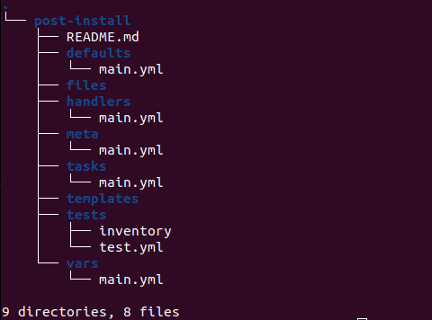

# Ansible

Ansible is simple and easy to use and doesn't need any server setups like other tools to run as agents. In Linux it uses SSH, in Windows it uses Windows winrm and it also uses API based methods. No databases or sophisticated configurations involved, it uses YAML,INI and Texts config files. No complex setup, it's just a Python Library, you can just use pip to install it. You write a playbook and run it against the target and give you back the report, no residuals left on the target nor the host machine. Ansible has API integration that can be used to talk to cloud  URL/Restful Calls, it can use Shell commands and scripts as well.

## Use Cases

### 1. Automation

    Ansible has so many use cases for example any system automation, ie. Windows automation, Linux automation, web services automation, database services automation, Start/stop services, etc.

### 2. Change Management

   Managing changes of production servers using playbooks as documentation

### 3. Provisioning
   
   You can provision servers from scratch/Cloud provisioning as well.

### 4. Orchestration
   
   Large scale automation framework, combining multiple automation tools and scripts together and execute them in an orderly fashion. You can combine Ansible with other tools like Jenkins, cloud services, etc.

### How Does Ansible Connect to remote computers/servers

1. From the control machine, it uses an API to connect to a Cloud 
2. To connect to a Windows server or remote host, it uses WINRM by enabling remote connection.
3. To connect to Linux it uses SSH
4. You can also manage network devices; switches, routers, etc, through Ansible.
5. Manage databases using its own Python Libraries, for example, MySQL would have its own particular one.

### Ansible Architecture

#### 1. Inventory File

You create an Inventory that will have target machines information for example, username, IP address, password etc.
 
#### 2. Playbooks

It will have information of the target hosts and also the module/modules you would like to execute on them. That gets recorded as a task that was fed from Inventory and Modules.

#### 3. Modules

There are already baked in modules of different tasks one can execute on target hosts. No need to reinvent the wheel.

#### 4. Ansible Config

The result is a script called Ansible config as a Python script/package that gets pushed to remote targets. If the target is the cloud the package would be executed locally but if it is a remote server/switch/database the package will be executed on the remote host. All of the execution will give a report.

Ansible is very simple but at the same time very powerful, it has a lot of features but only use them as the need arise. Also make the code as simple as possible. It can replace almost every or any automation tool in DevOps or Ops work.

### Setup Ansible & Infra

**Steps**

1. Create SSH keys in EC2 console named "control-key-pair" and "clients-key-pair"
2. EC2 Instance where Ansible is installed on it.
3. 3 EC2 instances running CentOS, two web servers and one DB server.
4. All setup on the web servers and the db server will be done by Ansible.
5. Later we will launch an Ubuntu web server EC2 Instance using Ansible as well.

**Infra Deployment**

1. Launch Ansible EC2 Control server and Set it up

   This EC2 was launched through [Terraform script](./Terraform-EC2-Nodes/Ansible-Control-Server/main.tf).
   
   Note: to clean /.ssh/known_hosts folder your host machine.

         cat  ~/.ssh/known_hosts
         cat  /dev/null > ~/.ssh/known_hosts

2. Remote into the Ansible control instance and install Ansible
   
         $ sudo apt update
         $ sudo apt install software-properties-common
         $ sudo add-apt-repository --yes --update ppa:ansible/ansible
         $ sudo apt install ansible

3. Launch 3 EC2 target instances 

   The EC2 target Instances were launched through [Terraform](./Terraform-EC2-Nodes/clients-EC2-Nodes/main.tf)

4. Create a repository in Ansible control node under ubuntu user and paste the [inventory](./vprofile/exercise1/inventory) content and save.
   
         mkdir vprofile && cd vprofile
         mkdir exercise1 && cd exercise1
         sudo vim inventory

5. Copy the content of the private key named "client-key-pair" and paste it on the new pem file.
   
   Go to your local machine, locate it and create a new pem file 

         cat ~/Downloads/client-key.pem
         sudo vim clientkey.pem
         sudo chmod "400" clientkey.pem

6. We need to backup and update this file; /etc/ansible/ansible.cfg at the moment it doesn't contain much. We need cat the file and copy the "ansible-config init --disabled > ansible.cfg" command and run it within the ansible folder.
   
         sudo -i
         ls /etc/ansible/ansible.cfg
         mv /etc/ansible/ansible.cfg /etc/ansible/ansible.cfg-backup
         cd /etc/ansible
         ansible-config init --disabled -t all > ansible.cfg

7. Search for the line; "host_key_checking=True" in the "ansible.cfg" and remove the semi-colon to remove the comment, "host_key_checking=True"

         vim ansible.cfg
         /host_key_checking=True
      
   Hit enter then i to remove the semi-colon and change the line to False

         host_key_checking=False
         esc
         :wq!
         exit
8. Enter into the inventory folder under ubuntu user and ssh into web01

         cd ~/vprofile/inventory
         ansible web01 -m ping -i inventory

   If successful, that's the message you'll see

         web01 | SUCCESS => {
            "ansible_facts": {
               "discovered_interpreter_python": "/usr/bin/python3"
            },
            "changed": false,
            "ping": "pong"
         }

   If you get permission denied error, chances are that the copying of the private key wasn't done correctly. There maybe a space within the key.
9. To create an inventory with multiple targets copy the inventory folder and add the info of the other two folders

         cd ../
         sudo cp -r exercise1 exercise2
         cd exercise2
         sudo vim inventory
         chmod "400" clientkey.pem
   
   Add web02 and db01 using this [yaml file](./vprofile/exercise2/inventory)

10. SSH into web02 and db01
    
         ansible web02 -m ping -i inventory
         ansible db01 -m ping -i inventory

11. To manage servers in [groups](./vprofile/exercise3/inventory) and using variables

         cd ../
         sudo cp -r exercise2 exercise3
         cd exercise3
         sudo vim inventory
         chmod "400" clientkey.pem

         # SSH into a webservers group
         sudo ansible webservers -m ping -i inventory -C
         sudo ansible webservers -m ping -i inventory
         sudo ansible 'web*' -m ping -i inventory

         # SSH into a dbservers group
         sudo ansible dbsrvgrp -m ping -i inventory
         sudo ansible 'db*' -m ping -i inventory

         # SSH into all servers, there are several options
         sudo ansible dc_virginia -m ping -i inventory
         sudo ansible all -m ping -i inventory
         sudo ansible '*' -m ping -i inventory

Note: When creating the yaml files, make sure you use space key not a tab key for the key:value pairs, otherwise you'll get an error.

### Adhoc Commands
Why use ad hoc commands?

ad hoc commands are great for tasks you repeat rarely. For example, if you want to power off all the machines in your lab for Christmas vacation, you could execute a quick one-liner in Ansible without writing a playbook. More details  can be found [here](https://docs.ansible.com/ansible/latest/command_guide/intro_adhoc.html).

An ad hoc command looks like this:

      $ ansible [pattern] -m [module] -a "[module options]"

The ping module is an example of adhoc commands, this section will 
explore more commands

**Steps**

1. Create a folder name exercise4

            sudo cp -r exercise3 exercise4
            cd exercise4
            sudo vim inventory
            chmod "400" clientkey.pem

2. Install Apache server on Web01 and Web02

            sudo ansible web01 -m ansible.builtin.yum -a "name=httpd state=present" -i inventory --become

            sudo ansible webservers -m ansible.builtin.yum -a "name=httpd state=present" -i inventory --become

3. Uninstall Apache server on Web01 and Web02 if present

            sudo ansible web01 -m ansible.builtin.yum -a "name=httpd state=absent" -i inventory --become

            sudo ansible webservers -m ansible.builtin.yum -a "name=httpd state=absent" -i inventory --become

4. Start and enable httpd service

            sudo ansible webservers -m ansible.builtin.service -a "name=httpd state=started enabled=yes" -i inventory --become

5. Create copy a file to webservers

            # Create a file locally, enter any text and save
            vim index.html

            sudo ansible webservers -m ansible.builtin.copy -a "src=index.html dest=/var/www/html/index.html" -i inventory --become

### Ansible Playbook & Modules

Ansible Playbooks are lists of tasks that automatically execute for your specified inventory or groups of hosts. One or more Ansible tasks can be combined to make a play—an ordered grouping of tasks mapped to specific hosts—and tasks are executed in the order in which they are written. For more details on playbooks go [here](https://docs.ansible.com/ansible/latest/playbook_guide/index.html)

**Steps**

1. Create a playbook named "web-db.yaml" copy from [here](./vprofile/exercise5/web-db.yaml). The folder will now have 3 files; inventory file, the playbook file and the ssh key file.

            sudo cp -r exercise4 exercise5
            cd exercise5
            sudo vim  web-db.yaml
            chmod "400" clientkey.pem 

      Note: In any folder you have secrets or ssh keys, you need to use gitignore so that you avoid publishing it in GitHub for example.

2. Before continuing we need to remove httpd services installed in webservers

            sudo ansible webservers -m yum -a "name=httpd state=absent" -i inventory --become

3. Run the playbook

            # normal execution

            sudo ansible-playbook -i inventory name-of-playbook
            sudo ansible-playbook -i inventory web-db.yaml

            # verbose execution
            
            sudo ansible-playbook -i inventory web-db.yaml -v
            sudo ansible-playbook -i inventory web-db.yaml -vv
            sudo ansible-playbook -i inventory web-db.yaml -vvv
            sudo ansible-playbook -i inventory web-db.yaml -vvvv
       
4. To check syntax of a playbook, if it finds an error it'll spit a message, otherwise it'll just display the name of the playbook

            sudo ansible-playbook -i inventory web-db.yaml --syntax-check

5. Dry run 

            sudo ansible-playbook -i inventory web-db.yaml -C

      Note: Once the playbook is created, you run a syntax check, the dry run and then execute it. On another note, you don't need to reinvent the wheel you can search for modules, scroll down to an example copy and edit it accordingly. For example; here is the [yum module](https://docs.ansible.com/ansible/latest/collections/ansible/builtin/yum_repository_module.html#ansible-collections-ansible-builtin-yum-repository-module).

### Modules
This section will look at how to fetch modules and reuse them.

Creating a file using a module, search the [documentation](https://docs.ansible.com/ansible/2.9/modules/modules_by_category.html)

**Steps**

1. Open > [Copy Module](https://docs.ansible.com/ansible/2.9/modules/copy_module.html#copy-module) > Scroll down to example and copy the copy module.

            sudo cp -r exercise5 exercise6
            cd exercise6
            sudo vim  web.yaml
            chmod "400" clientkey.pem 

2. Copy the [copy module](./vprofile/exercise6/web.yaml) content and paste in the "web.yaml" file.

      Syntax check, dry run and run

            sudo ansible-playbook -i inventory web.yaml --syntax-check
            sudo ansible-playbook -i inventory web.yaml -C
            sudo ansible-playbook -i inventory web.yaml

4. Copy the folder exercise5 because we need to re-use web-db.yaml file and rename it. The new file will be [db.yaml](./vprofile/exercise7/db.yaml)

            sudo cp -r exercise5 exercise7
            cd exercise7
            sudo vim  db.yaml
            chmod "400" clientkey.pem 

5. Open the database [module](https://docs.ansible.com/ansible/2.9/modules/list_of_database_modules.html) > [Add or remove DB](https://docs.ansible.com/ansible/2.9/modules/mysql_db_module.html#mysql-db-module), copy example and paste. It should look like [this one](./vprofile/exercise7/db.yaml).

      Syntax check, dry run and run

            ansible-playbook -i inventory db.yaml --syntax-check
            ansible-playbook -i inventory db.yaml -C
            ansible-playbook -i inventory db.yaml

      You get this error, it means that the target doesn't have the required dependency. 

            TASK [Create a new database with name 'accounts'] *******************************************************************************************************
            fatal: [db01]: FAILED! => {"changed": false, "msg": "A MySQL module is required: for Python 2.7 either PyMySQL, or MySQL-python, or for Python 3.X mysqlclient or PyMySQL. Consider setting ansible_python_interpreter to use the intended Python version."}

5. Remote into db server and check the requirement

            ssh -i clientkey.pem ec2-user@172.31.40.2 
            yum search python | grep -i mysql

            # copy the dependency
            python3-PyMySQL

            exit

6. Open the "db.yaml" playbook it should be like [this](./vprofile/exercise7/db.yaml)

            sudo vim db.yaml

      Syntax check, dry run and run

            ansible-playbook -i inventory db.yaml --syntax-check
            ansible-playbook -i inventory db.yaml -C
            ansible-playbook -i inventory db.yaml

      Error

            TASK [Create a new database with name 'accounts'] *******************************************************************************************************
            fatal: [db01]: FAILED! => 
      The error indicates that Ansible service is not able to talk to MySQL service. Services talk to each other through socket files.
      
7. Open the ["db.yaml"](./vprofile/exercise7/db.yaml) playbook and paste the line below. 

            login_unix_socket: /var/lib/mysql/mysql.sock

      Going forward we will use [Ansible Community version](https://docs.ansible.com/ansible/latest/collections/community/mysql/mysql_db_module.html#ansible-collections-community-mysql-mysql-db-module)

8. Installation onto the target, db01 server

            ansible-galaxy collection install community.mysql
            sudo vim db.yaml

            # Paste this name as name:
            community.mysql.mysql_db

9. Add user by using [MySQL user module](https://docs.ansible.com/ansible/latest/collections/community/mysql/)

      The updated code [here](/Ansible-notes/vprofile/exercise7/db.yaml)

      Syntax check, dry run and run

            ansible-playbook -i inventory db.yaml --syntax-check
            ansible-playbook -i inventory db.yaml -C
            ansible-playbook -i inventory db.yaml

### Ansible Configuration Settings

Ansible uses port 22 as a default port for SSH, however if you change SSH default ports in target hosts for security reasons, Ansible control won't be able to reach them.

#### Order of Ansible Config

1. The **ANSIBLE_CONFIG (environment variable if set)** takes the priority after setting the path of this configuration. Ansible will use this file not the global one. If nothing was declared there, then it will in turn use the global config file. Changes are done at system level.

2. **ansible.cfg (in the current directory)**, if you create this file in a folder where all ansible files are located, the file will have low priority to **ANSIBLE_CONFIG** but higher than the global config file. It is the recommended to crate this file in each repository since that would be shared across different teams. This is the only folder specific level config file.

3. Third priority goes to **~/.ansible.cfg (in the home directory)**, a hidden file that gets created during Ansible installation, the changes are made at system level.

4. The last is the **/etc/ansible/ansible.cfg** global level, this where we changed host key checking to false earlier on. Changes are made at the system level.

      
#### The breakdown of /etc/ansible/ansible.cfg settings file

Open the "/etc/ansible/ansible.cfg" file, descriptions and config settings can be found [here](https://docs.ansible.com/archive/ansible/2.4/intro_configuration.html).

**Steps**

1. Create a config file
   
            sudo -i
            vim /etc/ansible/ansible.cfg

2. Creating the Ansible [config file](./vprofile/exercise7/ansible.cfg)

            sudo vim ansible.cfg
            chmod "400" clientkey.pem

            sudo touch /var/log/ansible.log
            sudo chown ubuntu.ubuntu /var/log/ansible.log

3. Run

            ansible-playbook playbook-name
            ansible-playbook db.yaml

### Ansible VARIABLES

How to define variables in a playbook, these can be set below "hosts" or before the "tasks" section in the global configuration. They can be defined with the options presented.

#### 1. PLAYBOOK

      - hosts: webservers
        vars:
          http_port: 80
          sqluser: admin

#### 2. Inventory Based in the inventory file
      
      # All the hosts variable is for variables we want to use in the playbook. 
      
      group_vars/all

      # Variables for a particular group for example the webservers specific, dbservers, etc. you can define them using 

      group_vars/groupname

      # Variables for a specific host 

      host_vars/hostname

Note: All these variables are defined outside of the playbook

#### 3. Roles include variables from files in playbook

### Ansible builtin Variables 

Fact Variables: setup module

These get generated automatically when running a playbook. They can be used to select architecture for a software for example, etc.

      # OS name like RedHat, Debian, etc.
      ansible_os_family

      # Number of CPU cores
      ansible_processor_cores

      # Kernel Version
      ansible_kernel

      # Connected Device Information
      ansible_devices

      # IP, MAC address, gateway, etc
      ansible_default_ipv4

      # Ansible architecture, 64 bit or 32 bit
      ansible_architecture

Store Output: register module

These are run time variables that return output in JSON format after a playbook execution, you can then save the output into Variable Store. This could be that the next task may need to use the variable to run.

#### PLAYBOOK variables examples & Inventory Based examples outside the playbook

**Steps**

1. Using variables inside the playbook

            sudo cp -r exercise8 exercise9
            cd exercise9
            mkdir group_vars
            sudo vim group_vars/all
            chmod "400" clientkey.pem

2. Run the [playbook](./vprofile/exercise9/vars_precedence.yaml)

            ansible-playbook playbook-name
            ansible-playbook vars_precedence.yaml

3. The name of the folder has to be exactly "group_vars" and the file name, "all". Run the [playbook](./vprofile/exercise9/vars_precedence.yaml)

            ansible-playbook playbook-name
            ansible-playbook db.yaml

4. To suppress the Facts gathering that uses builtin run time variables cd exercise9 and edit it as per print fact [file](./vprofile/exercise9/vars_precedence.yaml) like below

            gather_facts: False

5. Run 

            ansible-playbook vars_precedence.yaml

      You'll notice that the "TASK [Gathering Facts]" disappear.

6. To pull specific variables, create a file named ["print_fact.yaml"](./vprofile/exercise9/print_fact.yaml)

            sudo vim print_fact.yaml

7. To view setup variables

            ansible -m setup server-name
            ansible -m setup web01

8. Create an ubuntu webserver using the [Terraform](./vprofile/exercise9/terraform/main.tf). 

      Cd into the terraform folder

            terraform init
            terraform apply

4. SSH into the Ansible control and update the inventory to reflect the hostname and username of web03

            sudo vim inventory

            web03:
            ansible_host: 172.31.95.117
            ansible_user: ubuntu

5. Run the setup module and fetch the variables

            ansible -m setup web01

6. Run the ansible facts playbook

            ansible-playbook vars_precedence.yaml

7. Run 

            ansible-playbook vars_precedence.yaml

#### Provisioning a server

**Goals**

1. NTP service setup on multi OS
2. Users & Groups
3. Changing configuration files
4. Decision making
5. Loops
6. Templates
7. Handlers
8. Ansible Roles

##### 1. NTP service setup on ubuntu and CentOS

**Steps**

1. Copy exercise9 to exercise10

            cp -r exercise9 exercise10
            cd exercise10
            chmod 400 clientkey.pem
            sudo rm -rf print_facts.yaml vars_precedence.yaml
            sudo vim provisioning.yaml

2. Run 

            ansible-playbook provisioning.yaml

      Note: It skipped installation on Centos because the package was already installed and it's in a running sate.

##### 2. Loops

Use Cases

If you have a number of packages to install on servers, you can create a loop of the packages to be installed in a list format. Like [so](./vprofile/exercise11/provisioning.yaml)

**Steps**

1. Copy folder

            cp -r exercise10 exercise11
            cd exercise11
            sudo vim provisioning.yaml

2. Change the name of the task and package name to a variable instead

            - name: Install centos packages
              yum:
                name: "{{item}}"

            - name: Install ubuntu packages
              yum:
                name: "{{item}}"

3. add below code after centos install task and ubuntu install task
      
            # Centos section
            loop:
            - chrony
            - wget
            - gir
            - zip
            - unzip

            # Ubuntu section
            loop:
            - ntp
            - wget
            - gir
            - zip
            - unzip
  
      For more info on loops check this [here](https://docs.ansible.com/ansible/latest/playbook_guide/).

##### 3. File, copy & template modules**

**Steps**

1. Open the provisioning file

            sudo vim provisioning.yaml

2. add a task that creates a motd file
      
         - name: Banner file
           copy:
             content: '# This server is managed by Ansible. No manual changes should be done.'
             dest: /etc/motd

4. SSH into web01 server to copy ntp config file content
      
            ssh -i clientkey.pem ec2-user@its-private-ip
            sudo -i
            cat /etc/chrony.conf

5. In the control server create a folder named templates

            sudo mkdir templates
            sudo vim templates/ntpconf_centos
            paste the copied content

6. SSH into db01 server to copy ntp config file content
            ssh -i clientkey.pem ubuntu@its-private-ip
            sudo -i
            cat /etc/ntp.conf

7. In the control server create a file named ntpconf_ubuntu
            
            sudo vim templates/ntpconf_ubuntu
            paste the copied content

8. Create ntp task like shown in the provisioning file [here](./vprofile/exercise12/provisioning.yaml)

      Update the [group variables](./vprofile/exercise12/group_vars/all) and the [templates folder](./vprofile/exercise11/templates/)

      Run 

            ansible-playbook provisioning.yaml -C
            ansible-playhttps://docs.ansible.com/ansible/latest/playbook_guide/book provisioning.yaml

#####  4. Choosing not to restart services by using handlers

   1. Create a file exactly like this [one](./vprofile/exercise13/provisioning.yaml)

            cp -r exercise12 exercise13
            cd exercise13
            sudo vim provisioning.yaml

      For more info on handlers check [here](https://docs.ansible.com/ansible/latest/playbook_guide/)

### Ansible Roles

Ansible roles help simply the playbook content, we have global declarations, variables inside and outside the playbook, tasks, files, handlers, etc. To make all this manageable that's where roles comes in to segregate content and organize it.

#### Examples of server roles

Identifying roles of different servers and common settings to help with the organization. Once that is done you can go ahead and create a role structure

1. MySQL servers
2. Tomcat
3. Build Server
4. Common Settings Post Install Steps
5. Wordpress
6. Apache

Role Structure Diagram

Tweak the provisioning.yaml file to add variable to create a file just to make it a bit complex. The file should look like this.

1. Before continuing install tree utility

            sudo apt install tree
            tree exercise14

2. Run the playbook

            ansible-playbook provisioning.yaml

3. To create role, run this command, "ansible-galaxy init role-name" replace role-name with your name like below.

            mkdir roles
            cd roles
            ansible-galaxy init post-install

      The result will be this message

            - Role post-install was created successfully

4. Enter into roles folder and run tree command, the role command created a structured folder tree. 

            cd roles
            tree

5. Copy all pertinent files to the role

            # Copy group_vars/all, host_vars/ and any variable in provisioning.yaml file.Paste them under vars/main.yaml
            cd exercise14
            cat group_vars/all

            # Remove group_vars and host_vars after copy the variables
            rm -rf group_vars host_vars

            # Copy all files from from files folder to roles/post-install/files
            cp files/* roles/post-install/files/

            # Copy all templates
            cp templates/* roles/post-install/templates/
            
            # Clean up the playbook
            cat provisioning.yaml

            # Copy Handlers section and paste
            sudo vim roles/post-install/handlers/main.yml 
            # Count the tabs and replace so there is no space in between
            :%s/^    //
            
            #copy tasks section from provisioning.yaml and paste it
            sudo vim roles/post-install/tasks/main.yml

            # Count the tabs and replace so there is no space in between
            :%s/^    //

            # Remove variables, tasks and handlers section from provisioning.yaml
            sudo vim provisioning.yaml
            roles:
            - post-install
      
            # Remove files folder and templates
            rm -rf files templates

            # Open tasks remove /templates because it would check the folder in the roles know where to find it. Add ".j2" extension to the template.
            sudo vim roles/post-install/tasks/main.yml

6. Updating ntp server for another region

            cp -r exercise14 exercise15
            cd exercise14

7. Move the variables from vars to defaults
      
            cat roles/post-install/vars/main.yml 
            sudo vim roles/post-install/defaults/main.yml 
8. Overriding ntp defaults in the vars in defaults file. change [ntp](https://www.ntppool.org/en/) server. The changes of the file [here](./vprofile/exercise15/provisioning.yaml).

            0.africa.pool.ntp.org
            0.africa.pool.ntp.org
            0.africa.pool.ntp.org
            0.africa.pool.ntp.org

      More info on role check [here](https://docs.ansible.com/ansible/latest/playbook_guide/playbooks_reuse_roles.html#role-directory-structure)

      To make your life easier there are also already made roles by the community members, here is the [reference](https://galaxy.ansible.com/ui/).

      Search for a role, for example if you want to install a [java role](https://galaxy.ansible.com/ui/standalone/roles/?page=1&page_size=10&sort=-created&keywords=java). Documentation for this particular role, [here](https://galaxy.ansible.com/ui/standalone/roles/shaneholloman/java/documentation/).

            ansible-galaxy role install shaneholloman.java

The role will be downloaded and get stored here

      /home/ubuntu/.ansible/roles/shaneholloman.java

To use the role, paste it under roles
            
      sudo vim provisioning.yaml
      roles:
        - shaneholloman.java

## Ansible for AWS

Just like any EC2 server provisioning we will follow the steps of the console [provisioning](https://docs.ansible.com/ansible/latest/collections/amazon/aws/docsite/guide_aws.html#ansible-collections-amazon-aws-docsite-aws-intro).

### 1. Authentication

   - Create an IAM user
      - Go to IAM > Users > Create user
        - user nam: "ansibleadmin"
      - Hit Next
      - Attach policies directly
        - Check the "AdministratorAccess"
      - Hit Next
      - Tagssudo vim provisioning.yaml
      roles:
        - shaneholloman.java

        - Key: "Name"
        - Value: "Ansible User"
      - Hit Create user
      - Click on Ansibleadmin > Security credentials > Access keys >  Create access key create-ec2-instance.yml
        - Use case
          - Select "Command Line Interface (CLI)"
          - Check the Confirmation box
      - Hit Next
      - Hit Create access key
      - Hit Download .csv file
      - Hit Done
   ### 2. Log into Ansible control server and export environmental variables for authentication
   
            # For temporary setup
            export AWS_ACCESS_KEY_ID='your-ansibleadmin-key'
            export AWS_SECRET_ACCESS_KEY='your-ansibleadmin-key'

            # For permanent setup, open .bashrc file and paste at the bottom the export commands and source it
            sudo vim ~/.bashrc
            export AWS_ACCESS_KEY_ID='your-ansibleadmin-key'
            export AWS_SECRET_ACCESS_KEY='your-ansibleadmin-key'
            source .bashrc

   ### 3. Install ansible aws dependencies
   
            sudo apt install python3-pip -y
            sudo pip3.10 install boto3
            sudo ansible-galaxy collection install amazon.aws

   ### 4. Create an EC2 playbook

   Open ansible [module index](https://docs.ansible.com/ansible/2.9/modules/modules_by_category.html). Select Cloud modules > ec2_key – create or delete an ec2 key pair
   
            mkdir aws && cd aws && sudo vim create-ec2-instance.yml

   ### 5. Create and manage EC2 instances

   Go to [cloud modules](https://docs.ansible.com/ansible/2.9/modules/list_of_cloud_modules.html) > ec2_instance – Create & manage EC2 instances, example [here](./aws-ansible/create-ec2-instance.yml)
   
   ### 6. Run the [playbook](./aws-ansible/create-ec2-instance.yml.yaml)
   
            ansible-playbook create-ec2-instance.yml

Note: Better tool for cloud resources management is Terraform

## YAML & JSON Refresher
A Python dictionary is like JSON in another format and a stripped dictionary in YAML.

Dictionary example with three key:value pairs a bit complex to read

      {"DevOps": ["AWS", "Jenkins", "Python", "Ansible], "Development": ["Java", "NodeJS", ".NET"], "ansible_facts": {"python": "/usr/bin/python"}}

Making it more readable is turning it into vertical outlook, and tah daa! You have JSON

      {
         "DevOps": 
         [
            "AWS", 
            "Jenkins", 
            "Python", 
            "Ansible
         ], 
         "Development": 
         [
            "Java", 
            "NodeJS", 
            ".NET"
         ], 
         "ansible_facts": 
         {
            "python": "/usr/bin/python"
         }
      }

Converting a JSON into YAML by removing curly brackets and square brackets

         DevOps: 
         - AWS 
         - Jenkins
         - Python 
         - Ansible
  
         Development: 
         - Java
         - NodeJS 
         - .NET
         
         ansible_facts: 
           python: /usr/bin/python
           version: 3.10

Note: Ansible format is YAML but the results are returned in JSON.

# References
1. [Ansible main Documentation](https://docs.ansible.com/ansible/latest/)
2. [Ansible Ubuntu section](https://docs.ansible.com/ansible/latest/installation_guide/installation_distros.html#installing-ansible-on-ubuntu)
3. [Ansible YAML syntax](https://docs.ansible.com/ansible/latest/reference_appendices/YAMLSyntax.html)
4. [Adhoc commands](https://docs.ansible.com/ansible/latest/command_guide/intro_adhoc.html)
5. [Ansible Playbook Syntax](https://docs.ansible.com/ansible/latest/playbook_guide/playbooks_intro.html#playbook-syntax)
6. [Ansible Modules](https://docs.ansible.com/ansible/latest/collections/index_module.html)
7. [Ansible Community](https://docs.ansible.com/ansible/latest/collections/community/mysql/mysql_db_module.html#ansible-collections-community-mysql-mysql-db-module)