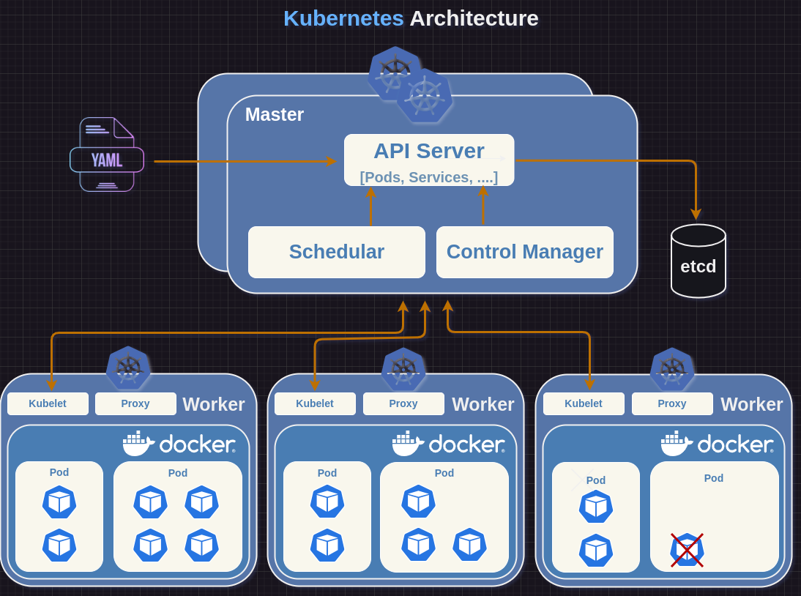
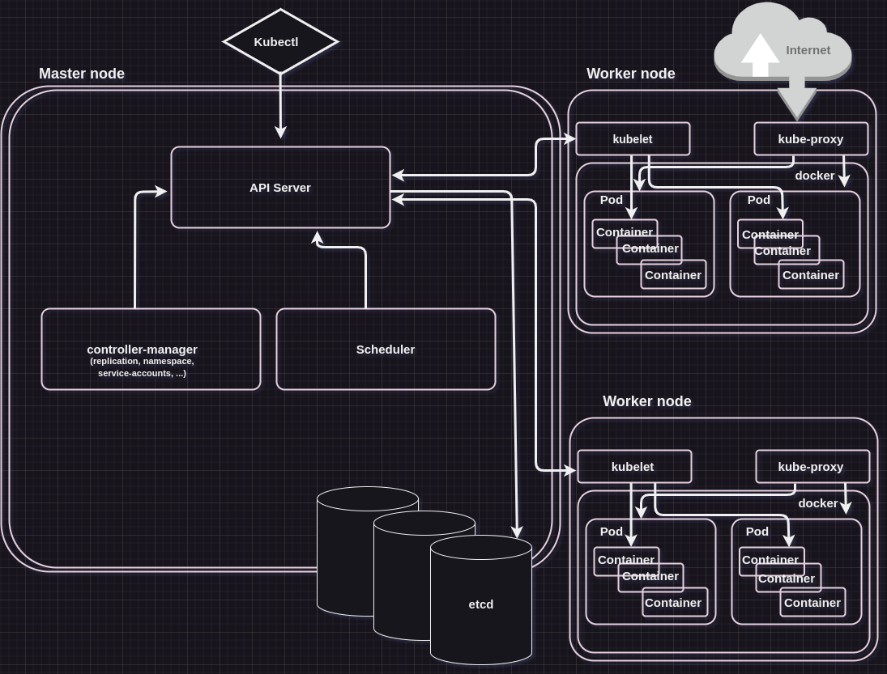
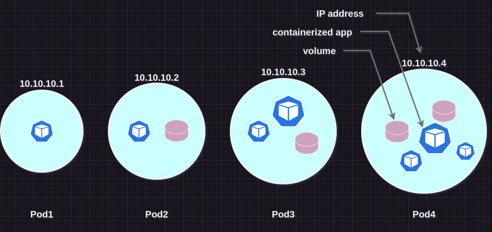
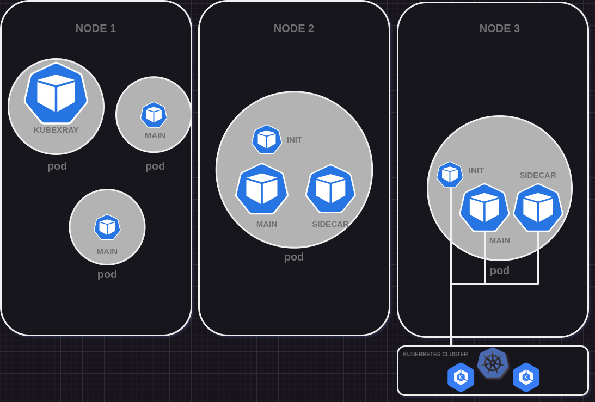
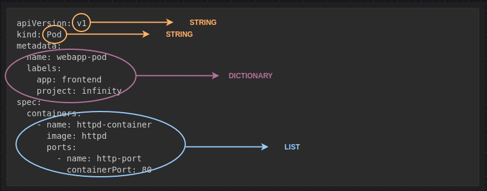
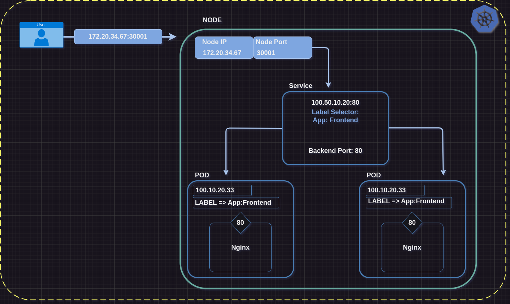
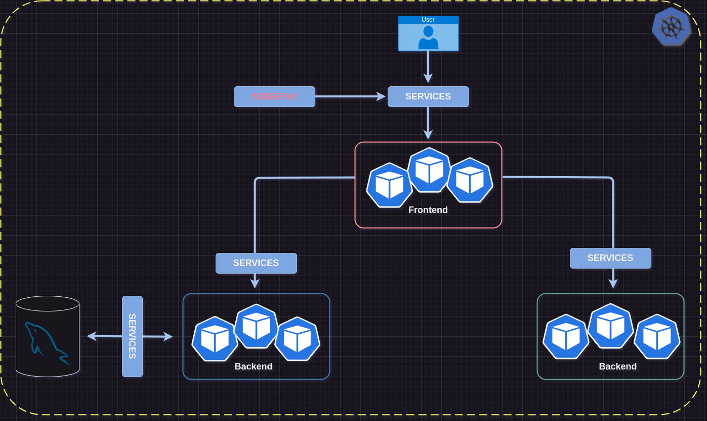
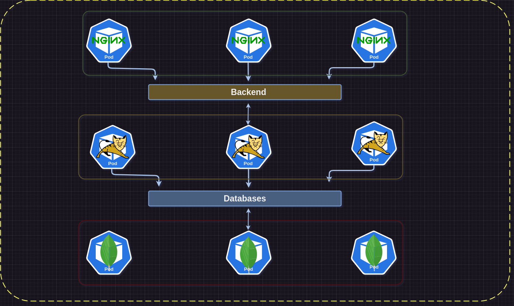

# Kubernetes
Kubernetes is not a replacement of Docker Engine rather it manages Docker Engine Cluster(s)

## Kubernetes Features

- Service discovery and load balancing
- Storage orchestration
- Automated rollouts and rollbacks
- Automatic bin packing
  - Placing the pod on the right node where it gets right resources to run based on the requirements
- Self-healing
  - Containers get replaced when one fails automatically
- Secret and configuration management

## Kubernetes Architecture

### Master node/Control Plane

-  It is the node that manages worker nodes. You connect to Master node and give instructions to it to run so and so containers. It takes the action based on the requirements. In Master node, you have four services; API Server, Schedular, Controller Manager and etcd. You can also add other services as addons, the above are the four main services in Control Plane. Let's get a breakdown of functionality of each service.

#### Kube API Server

- This is the main hero! Handles all the requests and enable communication across all stack services. It handles all incoming and outgoing communications in a Kubernetes cluster. When you want to send instructions to Kubernetes, Kube API Server is going to receive that and pass it over to other services, i.e. Scheduler, etcd, Control Manager and worker nodes.
- A component on the Master exposes the Kubernetes API. If one would prefer, can also build a tool that integrates with Kubernetes API, or a use a third party tool altogether that integrates with Kubernetes like, monitoring agents, logging agents, web dashboards.
- It is the frontend of for the Kubernetes control plane
- Admins connect to it through **Kubectl CLI**
- There is a Web Dashboard that can be integrated with API Server
- And many more integrations
 
#### etcd Storage Server

- **etcd** is a key value store that stores all the information of your Kubernetes cluster. 
- It is consistent and highly-available key value store used as Kubernetes' backing store for all cluster data
- Kube API stores and retrieves information from it
- It will have all the information of runtime and it should be backed up regularly. If it fails, you lose data and you wouldn't know what pod is running where etc. The container will still run but you'll lose the information.
- It stores the current state of everything in a cluster

#### Schedular

- **Schedular** is going to schedule your container on the right node
- It watches newly created pods that have no node assigned and selects a node for them to run on. It sends information to a worker node telling it, 'hey!' you need to run this container
- It takes into account several factors to decided the scheduling
  - Individual and collective resource requirements 
  - Hardware/software/policy constraints
  - Affinity and anti-affinity rules/specifications, for example you can say, I want to run my container on this particular node or don't run it on this particular node.
  - Data locality
  - Inter-workload interference and deadlines

#### Controller Manager

- **Controller Manager** is actually a group of controller separate services running.
- To reduce complexity, they are all compiled into a single binary and run in a single process
- These controllers include:
  - **Node Controller:** Responsible for monitoring/noticing and responding when nodes go down
  - **Replication Controller:** Responsible for maintaining the correct number of pods for every replication controller object in the system. If a pod goes down, it would do auto healing.
  - **Endpoints Controller:** Populates the Endpoints object (that is, joins Services and Pods)
  - **Service Account and Token Controllers:** Create default accounts and API access tokens for new namespace. Manages authorization and authentication

### Worker node

- It is comprised of three services namely; Kubelet, Proxy and the Docker Engine

- **Kubelet:** is an agent that runs on every node in the cluster. It makes sure that containers are running in a pod. It listens to Kubernetes master's commands/requests.
- When a Schedular decides that it is going to run a particular container in a certain pod, it assigns the task to a Kubelet. The Kubelet is going to fetch the image and run the container from it. Basically, it does the heavy lifting. As we run the commands docker run -p -v. Kubelet will be doing those tasks.

- **Kube Proxy:** is a network proxy that runs on each and every node in your cluster
- You can set Network Rules
  - Rules to allow network communications to your Pods inside or outside of your cluster

- **Control Runtime:** Kubernetes supports several container runtimes
  - Docker
  - Containerd
  - Cri-o, rktlet
  - Kubernetes CRI (Container Runtime Interface)

### Addons

- DNS
- Web UI
- Container Resource Monitoring
- Cluster Level Logging

### K8s Workflow



1. An admin sends command instructions to the Kubernetes API Server in the Master Node through Kubectl
2. The Master Node has an API Server that enables communication, Controller Manager will monitor worker node, manage authentication and manages replication. Scheduler decides on which node your container will be running and etcd stores information
3. The Worker node has kubelet which is the agent that fetches the image, run the containers, map the volumes, etc.
4. Kube proxy is a network proxy, allowing or disallowing traffic to and from, in or out of the Kubernetes cluster. Exposing ports to outside world, you do it through Kube proxy, setting network rules, etc.
5. Docker Engine is where your containers will be running.


### PODS

What relation does a Pod have with a container? It's the same relation a VM has with a service running inside it. For example a Tomcat service is running in a VM, the VM will provide all the resources to the Tomcat service such as RAM, CPU, Storage, Network etc. The Service will just use it. Similarly, a Pod provides all the resources to a container, a container will be running inside a Pod. The container will be like a process and a pod will be like a VM. Of course, here we are talking of isolation not about virtualization. Why does Kubernetes uses pod instead of running containers directly on its nodes? The reason is that Kubernetes can run different container runtime environments like Docker, Containerd, etc. If there is no existence of a pod, there will be no abstraction. Pod uses standard set of commands, standard set of configuration etc that can be used on those different runtime environments. This makes it possible not to be concerned with what type of container ends up running in a pod, no matter what technology is running behind the scenes.




##### Example above

1. **Pod1** has a single container
2. **Pod2** has a container and a volume attached to it
3. **Pod3** has two containers both attached to one volume
4. **Pod4** has three containers of different sizes and they are two volumes in a pod.

### Should You Run a Single Container in a POD?

It depends;

1. Ideally you would see one pod to one container ratio like in Node Server 1
2. In Node Server 2 and 3 you have 3 containers, INIT container starts, run some commands then it dies, then the main container starts with the sidecar container. Sidecar container's work is to assist the main container. For example streaming logs or it could be a monitoring agent. However, at any given time you should have the main container only running in the pod.



### Overlay Network


Overlay Network could be likened to a VPC where all the resources within it are connected. Every node will have a subnet.

- So if Node 1 is Tomcat and Pod 6 is MySQL, they can communicate since they are in the same Overlay Network.
- Every node will have like a subnet/LAN running inside it. The bridge0 will act like a switch for the subnet
- All the pods within Node 1 will be able to communicate to each other using bridge0.
- When pods in Node 1 need to connect to other pods in other Nodes, for instance Node 2 or 3 they send the traffic to **wg0 - 10.90.1.1** which acts as a router.
- When the traffic is received in the Node 2 for example, the router **wg0 - 10.90.2.1** will forward the traffic to the destination pod.
- The traffic that goes outside the cluster will or that comes into the cluster would go through the host ethernet adapter **eth0 - 192.168.33.101**

## Kubernetes Setup Tools

- Hard Way: Manual Setup
- Minikube: For testing and learning purposes
  - One Node Kubernetes cluster on your computer
- Kubeadm: Enterprise grade for production
  - Multi node Kubernetes Cluster
  - Can be created on any Platform, be it VMs, EC2, Physical machines, etc
- Kops: Most stable way to run production Kubernetes
  - Multi node Kubernetes Cluster on AWS, GCP, DigitalOcean, and OpenStack

### Minikube for K8s Setup

Minikube runs on [VirtualBox](https://www.virtualbox.org/wiki/Linux_Downloads) or Docker Engine, you need to have installed Docker Engine or VirtualBox before installing Minikube.

[Installing Minikube](Installing%20Minikube.md) on Ubuntu 20.04 LTS or 22.04 LTS

#### Minikube K8s Hands on

1. Clone source [code](https://github.com/devopshydclub/vprofile-project)

        mkdir minikube
        git clone https://github.com/devopshydclub/vprofile-project.git
        
2. Switch git branch to Kubernetes

        cd vprofile-project
        git checkout kubernetes-setup
        git branch
        ls
3. Go into minikube

        cd minikube
        ls
        minikube start

4. Kubeconfig file used by kubectl command location

        cat ~/.kube/config
        kubectl get nodes
    The get nodes command or any kubectl command is using the above file to connect to kubernetes cluster

5. [Create a Deployment ](https://kubernetes.io/docs/tutorials/hello-minikube/)
    
    1. Create a Deployment that manages a Pod. The Pod runs a Container based on the provided Docker image.
        
            kubectl create deployment hello-node --image=registry.k8s.io/e2e-test-images/agnhost:2.39 -- /agnhost netexec --http-port=8080
        
    2. View Deployments
    
            kubectl get deployments

        The output is similar to:
        
            NAME         READY   UP-TO-DATE   AVAILABLE   AGE
            hello-node   1/1     1            1           2m49s
        
        (It may take some time for the pod to become available. If you see "0/1", try again in a few seconds.) The hello-node deploy is running the pod listed by *kubectl get pods* command
    3. View the Pod:
    
            kubectl get pods
    
        The output is similar to:

            NAME                          READY   STATUS    RESTARTS   AGE
            hello-node-55fdcd95bf-swpc8   1/1     Running   0          2m11s
    
    4. View cluster events:
   

            kubectl get events

    6. View the kubectl configuration:

            kubectl config view
    
    7. View application logs for a container in a pod (replace pod name with the one you got from *kubectl get pods*).

        Note: Replace hello-node-55fdcd95bf-swpc8 in the *kubectl logs* command with the name of the pod from the *kubectl get pods* command output.

            kubectl logs hello-node-55fdcd95bf-swpc8


        The output is similar to:

            I0827 17:25:17.515897       1 log.go:195] Started HTTP server on port 8080
            I0827 17:25:17.516104       1 log.go:195] Started UDP server on port  8081

        Note: For more information about *kubectl* commands, see the [kubectl overview](https://kubernetes.io/docs/reference/kubectl/).

6.  Create a Service

    By default, the Pod is only accessible by its internal IP address within the Kubernetes cluster. To make the *hello-node* Container accessible from outside the Kubernetes virtual network, you have to expose the Pod as a Kubernetes [Service](https://kubernetes.io/docs/concepts/services-networking/service/).


    **Warning**:
    The agnhost container has a */shell* endpoint, which is useful for debugging, but dangerous to expose to the public internet. Do not run this on an internet-facing cluster, or a production cluster.

    1. Expose the Pod to the public internet using the *kubectl expose* command:
    
           kubectl expose deployment hello-node --type=LoadBalancer --port=8080 


        The *--type=LoadBalancer* flag indicates that you want to expose your Service outside of the cluster.

        The application code inside the test image only listens on TCP port 8080. If you used *kubectl expose* to expose a different port, clients could not connect to that other port.
    
    2. View the Service you created:
    
            kubectl get services
        
        The output is similar to:

            NAME         TYPE           CLUSTER-IP     EXTERNAL-IP   PORT(S)          AGE
            hello-node   LoadBalancer   10.109.29.74   <pending>     8080:32425/TCP   13s
            kubernetes   ClusterIP      10.96.0.1      <none>        443/TCP          124m

        On cloud providers that support load balancers, an external IP address would be provisioned to access the Service. On minikube, the *LoadBalancer* type makes the Service accessible through the *minikube service* command.
    3. Run the following command:
    
            minikube service list

            or 

            minikube service hello-minikube --url

        This will display the URL of the app
    
    4. Clean up


            kubectl get svc
        
        The output similar to this:

            NAME         TYPE           CLUSTER-IP     EXTERNAL-IP   PORT(S)          AGE
            hello-node   LoadBalancer   10.109.29.74   <pending>     8080:32425/TCP   13m
            kubernetes   ClusterIP      10.96.0.1      <none>        443/TCP          137m
        
        Delete service
            
            kubectl delete svc hello-node

        Delete deployment

            kubectl get deployments
        
        The output similar to this:

            NAME         READY   UP-TO-DATE   AVAILABLE   AGE
            hello-node   1/1     1            1           124m

            kubectl delete deployments hello-node

        Stop Minikube cluster

            minikube stop

        Delete Minikube cluster

            minikube delete


### Setup with Kops

#### Prerequisites

- Domain for Kubernetes DNS records
    - e.g. mbadwa.com from **GoDaddy**
- Create a Linux VM and set it up in AWS or Vagrant VM
  - kops, kubectl,ssh keys, awscli 
- Login to AWs account and setup
  - S3 bucket, IAM User for AWSCLI, Route53 Hosted Zone
- Log into Domain Registrar(GoDaddy) 
  - Create NS records for subdomain pointing to Route 53 hosted zones NS servers

#### Kops K8s

  1. Launch an EC2 instance
   
       -  Go to EC2 > Instances > Launch instances
          -  Name and tags > Name
             -  kops
          - Application and OS Images (Amazon Machine Image) > Amazon Machine Image (AMI)
            - Ubuntu Server 22.04 LTS (HVM), SSD Volume Type
          - Instance type > Instance type
            - t2.micro
          - Key pair (login) > Create new key pair
            - kops-key
          - Create key pair
          - Network settings > Edit
            - Security group name - required
              - kops-SG
            - Description - required
              - kops-SG
            - Inbound Security Group Rules
              - Type: ssh, Protocol: TCP, Port range: 22, Source type: My IP
       -  Launch instance
    
            NOTE: Kops instance is not part of Kubernetes, it's just being used to launch a kubernetes cluster
  
  2. Create S3 Bucket in the same region as the VM instance
     - Go to S3 > Create bucket 
       - Bucket name
         - kops-unique-name
       - Create bucket
  3. Create IAM User
     - Go to IAM > Users > create user
       - User details > User name
         - kopsadmin
       - Permissions options > Add user to group
         - admin
       - Hit Next
       - Create user
       - Click on kopsadmin > Security credentials > Access keys (0)
         - Hit Create access key
           - Use case 
             - Command Line Interface (CLI)
           - Confirmation
             - Check the box
         - Hit Next
         - Create access key 
         - Download .csv file
         - Hit Done

     
     NOTE: Option to create a user using group permissions or directly 
     attached permissions but they have to have "AdministratorAccess"   
  
  4. Route 53 DNS Settings
      - Go Route 53 > Dashboard > DNS management > Hosted zones
      - Create hosted zone
        - Domain name
          - kubevpro.your-domain-name
        - Type
          - Public hosted zone
        - Hit Create hosted zone
  
  5. Copy NS Servers and paste in GoDaddy
       - Go to [GoDaddy](https://dcc.godaddy.com/) or your DNS registrar > Domains > DNS > Name Servers 
       - Hit Change name servers > Add (Similar to those). Make sure you add without a `dot` at the end of each

                ns-826.awsdns-39.net
                ns-1456.awsdns-54.org
                ns-1629.awsdns-11.co.uk
                ns-410.awsdns-51.com
        
  6. SSH into the VM instance
    
         $ chmod "400" kops-key.pem
         $ ssh -i "kops-key.pem" ubuntu@your-vm-public-key
  
  
  7. Generate SSH key for kops
  
         $ ssh-keygen
  
  8. Install AWSCLI enter the credentials downloaded earlier, format put json
  
         $ sudo apt update && sudo apt install awscli -y
         $ aws configure
  
  9. Install [Kubectl](https://kubernetes.io/docs/tasks/tools/install-kubectl-linux/). Follow the given instructions
  10. Install [kOps](https://github.com/kubernetes/kops/releases) >  [v1.26.4](https://github.com/kubernetes/kops/releases/tag/v1.26.4) > Scroll to Assets > kops-linux-amd64

      - Copy the link 
  
            $ wget https://github.com/kubernetes/kops/releases/download/v1.26.4/kops-linux-amd64
            $ ls
            $ chmod +x kops-linux-amd64
            $ sudo mv kops-linux-amd64 /usr/local/bin/kops
            $ kops version
  11. Verify your domain
  
            $ nslookup -type=ns kubevpro.mbadwa.com

  12. Create a k8s configuration file and store it in S3 bucket using kops
  
            $ kops create cluster --name=kubevpro.mbadwa.com \
            --state=s3://your-bucket-name --zones=us-east-1a,us-east-1b \
            --node-count=2 --node-size=t3.small --master-size=t3.medium --dns-zone=kubevpro.mbadwa.com \
            --node-volume-size=8 --master-volume-size=8

            # Finally, configure your cluster with: 
            $ kops update cluster --name kubevpro.mbadwa.com --state=s3://kops-mbadwa-bucket --yes --admin
  
  13. Wait 25-30 min then validate the cluster

            $ kops validate cluster --state=s3://kops-mbadwa-bucket
  
  14. Go to EC2 > instances > nodes-us-east-1a.kubevpro.mbadwa.com > Security > Security Groups > Edit
      - Add rule
        - All Traffic from MY IP
  
  15. When kops creates a cluster it also creates a kube config file for kubectl that used to connect to the cluster
  
            $ cat ~/.kub/config

      Kops creates autoscaling groups, VPC, adds new records in Route 53. You can verify by checking them out
  16. Clean up

            $ kops delete cluster --name=kubevpro.mbadwa.com --state=s3://kops-mbadwa-bucket --yes
            $ sudo poweroff

#### How to pause your kOps-managed Kubernetes cluster on AWS

These are instructions on how to pause your kOps-managed Kubernetes cluster gracefully. After following these steps, if you re-spawn your cluster, all the existing k8s components will be retained.

#### Pre-requisites

These steps assumes that you have a kOps managed Kubernetes cluster running on AWS.

**Steps**

1. Run `kops get ig` to list the instance groups. You will see two instance groups — one for the control plane and one for your worker nodes.Eg: If you’ve been using kOps in the us-east-1a and us-east-1b availability zones, you will see ```control-plane-us-east-1a``` & ```nodes-us-east-1a```.
   
        $ kops get ig

2. Run `kops edit ig nodes-us-east-1a` and change the `minSize` and `maxSize` values to 0.
   
        $ kops edit ig nodes-us-east-1a --state=s3://kops-mbadwa-bucket
        $ kops edit ig nodes-us-east-1b --state=s3://kops-mbadwa-bucket

3. Do the same for the control page group by running `kops edit ig control-plane-us-east-1a`.

        $ kops edit ig control-plane-us-east-1a --state=s3://kops-mbadwa-bucket

4. To apply these changes to your cluster, run `kops update cluster --name=${NAME} --yes`. Here NAME is a global variable referring to the name of your cluster.

        $ kops update cluster --name=${NAME} --state=s3://kops-mbadwa-bucket --yes

5. If you get a message “Changes may require instances to restart: kops rolling-update cluster”, just run ```kops rolling-update cluster```.

        $ kops rolling-update cluster --state=s3://kops-mbadwa-bucket --yes

    This will terminate all worker nodes & control plane nodes, but persist the cluster state in your S3 state store. If you re-spawn your cluster, all the existing pods will be retained. 


## Kubernetes Objects and Documentation

For understanding purposes you can say a container is an object in Docker Engine

### K8s Objects
  - Pod
    - A smallest object that gets created in K8s, container(s) lives inside a pod. We don't directly touch containers, we manage pods in turn the pods manage the containers on our behalf.
  - Service
    - To have an endpoint URL to your pod just like a load balancer endpoint for an EC2 instance
  - Replica Set
    - To create a cluster of pods or replica of same pod
  - Deployment
    - Works similar to Replica Set, additionally you deploy new image tags by using deployments. Deployment is the most used object as far as DevOps is concerned.
  - Config Map
    - To store our variables and configuration
  - Secret
    - Variables and some information you can store which are not in clear text
  - Volumes
    - Just like we have EBS volume attached to an instance there are different kinds of volumes that can be attached to a pod

### [K8s Documentation](https://kubernetes.io/docs/home/)

  - You can search for a [pod](https://kubernetes.io/docs/concepts/workloads/pods/) in the search box and read about it
  - Check out the documentation on different use cases, no need to memorize anything.

## Kube Config

When a cluster is created, for it to do the authentication and authorization to Kubectl among other things, it creates a Kubeconfig file that stores all the information need.

Use kubeconfig files to organize information about;

   1. Clusters
   2. Users
   3. Namespaces
   4. Authentication mechanisms
   
The Kube config file location

    $ ls -a
    $ ls .kube/
    $ less .kube/config

Information 

- Clusters
  - Cluster information with its Certificate for the cluster
  - Server 
    - Server URL of Master Node API lives in Master Node
  
          https://api.kubevpro.mbadwa.com

    When the cluster was being created, kOps did one more thing, that is, In Route 53 it created an API with an A record, its value being the public IP Address of the Master Node. You can verify in DNS Settings in Route 53 and then check it against the master node IP address. The API server lives in the control plane of the Master Node. Kubectl connects to the API Server, i.e. the Master Node. Basically, the URL resolves to the given public IP.
    - name 
  
          kubevpro.mbadwa.com

      This is the name of the cluster
- Users:
  
      - name: kubevpro.mbadwa.com
        user: Certificate and below it is a key

- contexts:
  - context: Is found in the middle, ironically, its job is to marry the cluster with the user

        cluster: kubevpro.mbadwa.com
        user: kubevpro.mbadwa.com
  In this case username and cluster name are the same. 

  - current-context: kubevpro.mbadwa.com
  
  You can have multiple cluster information, multiple user information and multiple contexts but Kubectl by default will use your current context. More details in [Kubeconfig](https://kubernetes.io/docs/concepts/configuration/organize-cluster-access-kubeconfig/)

## Namespaces
In Kubernetes, *namespaces* provide a mechanism for isolating groups of resources within a single cluster. Names of resources need to be unique within a namespace, but not across namespaces. Namespace-based scoping is applicable only for namespaced objects *(e.g. Deployments, Services, etc.)* and not for cluster-wide objects *(e.g. StorageClass, Nodes, PersistentVolumes, etc.).*

Namespaces are used for security, quotas, and few other things. When a Kubernetes cluster is created, it'll have a default, kube-system, kube-public namespaces. You can also create additional name spaces if you wish.

### Default Namespaces
This is how the default name space look like when created


### Default Namespaces Plus
You can isolate your environment by creating different namespaces for different projects, or dedicate different namespaces for different use cases.


More regarding Namespaces [here](https://kubernetes.io/docs/concepts/overview/working-with-objects/namespaces/). Deleting a Namespace actually deletes all resources within it.

### Kubectl Namespace Commands

To get a current context namespace

    $ kubectl get namespaces

    or 

    $ kubectl get ns

Output:

    NAME              STATUS    AGE
    default           Active    25h
    kube-node-lease   Active    25h
    kube-public       Active    25h
    kube-system       Active    25h

Running this command shows all objects in default namespace

    $kubectl get all

Output:

    NAME         READY     STATUS   RESTARTS      AGE
    pod/nginx1   1/1       Running  1 (59m ago)   61m

    NAME                TYPE        CLUSTER-IP     EXTERNAL-IP      PORTS    AGE
    Service/kubernetes  ClusterIP   100.64.0.1      <none>           443/TCP  89m

The pod we created ourselves but the service was created automatically

Running this command will get all namespaces

    $ kubectl get all --all-namespaces

Output:

    Too long to put it here.

To get from specific namespace

    $ kubectl get svc -n kube-system

Output:

    NAME          TYPE        CLUSTER-IP     EXTERNAL-IP      PORTS                     AGE
    kube-dns      ClusterIP   100.64.0.10      <none>         53/UDP,53/TCP,9153/TCP    90m

Creating a custom name space

    $ kubectl create ns kubekart

Output:

    namespace/kubekart created

Create a pod in kubekart namespace

    $ kubectl run nginx1 --image=nginx -n kubekart

Output

    pod/nginx1 created

Creating a pod from a yaml [file](pod1.yaml)

    $ kubectl apply -f pod1.yaml

Output

    pod/nginx-01 created

Check if the new pod was created

    NAME          READY     STATUS   RESTARTS    AGE
    pod/nginx1    1/1       Running  0           81s
    pod/nginx-01  1/1       Running  0           8s

Delete the test name space kubekart, note be careful in prod environment, the command is disastrous, this deletes everything inside the namespace and the namespace itself

    $ kubectl delete ns kubekart

Output:

    namespace "kubekart" deleted

## PODS

A pod is the basic execution unit of a Kubernetes application-the smallest and simplest unit in Kubernetes object model that you create or deploy. A Pod represents processes running on your Cluster.

- **Pods that run a single container**
  - The "one-container-per-Pod" model is the most common Kubernetes use case.
  - Pod act as a wrapper around a single container
  - Kubernetes manages the Pods as opposed to managing containers directly, it give the abstraction layer, all commands are directed at the Pod.

- **Multi Container POD**
  - Tightly coupled and need to share resources
  - One Main container and other as a sidecar or init container or both.
  - Each Pod is meant to run a single instance of a given application
  - For HA, you should use multiple Pods to scale horizontally. Not multiple containers in a Pod rather multiple pods of say, Tomcat pods, nginx pods, etc.
  
- **Definitions file in YAML**

  Just as we've been running containers with Docker run command and also running with Docker Compose to better manage the containers similarly you can run Kubernetes pod directly on the cluster or you can run them through a Definitions file. The Definition file is the most suitable way since you'll have Infrastructure As a Code (IAC).

  A Definitions file normally have at least four lines, namely; apiVersion, kind, metadata and spec. The kind field is where you define the type of object. Metadata has information about the pod, data about data. Spec contains technical details, since this file is a Pod definition file, then naturally the spec will be containers.
  
  This is a simple pod when executed it will run a pod within which there an apache httpd container created from httpd image and running on port 80.


      apiVersion: v1
      kind: Pod
      metadata: 
        name: webapp-pod
        labels:
          app: frontend
          project: infinity
      spec:
        containers:
          - name: httpd-container
            image: httpd
            ports:
              - name: http-port
                containerPort: 80 

  **Kind Objects**

      |-------------|-------------------------------|
      | Kind        | Version                       | 
      |-------------|-------------------------------|
      | Pod         | v1                            | 
      |-------------|-------------------------------|
      | Service     | v1                            | 
      |-------------|-------------------------------|
      | Deployment  | v1                            | 
      |-------------|-------------------------------|
      | Ingress     | networking.../v1beta1         | 
      |-------------|-------------------------------|
     

  **Technical breakdown**

  
  apiVersion and Kind values are a list, metadata value is a dictionary (key:value pair) and the spec value is a list, of course here there is just one item listed, i.e. one container.

  **How to create a Pod**
    
    Run

      $ kubectl create -f webapp-pod.yaml

    Output

      pod/webapp-pod created

    Get Pod Info 

      $ kubectl get pod
      NAME        READY       STATUS              RESTARTS    AGE
      webapp-pod  0/1         ContainerCreating   0           51s 

    Status Changes as it is being created

      $ kubectl get pod
      NAME        READY   STATUS    RESTARTS    AGE
      webapp-pod  1/1     Running   0           9m30s 

    Get detailed pod info

      $ kubectl describe pod webapp-pod
      Name:                     webapp-pod
      Namespace:                default
      Priority:                 0
      PriorityClassName:        <none>
      Node:                     minikube/10.0.2.15
      Start Time:               Wed, 28 Aug 2024 15:11:27 +0530
      Labels:                   app=frontend
                                project=infinity
      Annotations:              <none>
      Status:                   Running
      IP:                       172.17.0.4
      Events:
        Type      Reason        Age       From                  Message
        ----      ------        ----      ----                  -------
        Normal    Scheduled     17m       default-schedular     Successfully assigned default/webapp-pod to minikube
        Normal    Pulling       17m       kubelet, minikube     Pulling image "httpd"
        Normal    Pulled        9m37s     kubelet, minikube     Successfully pulled image "httpd"
        Normal    Created       9m37s     kubelet, minikube     Created container httpd-container
        Normal    Started       9m36s     kubelet, minikube     Started container httpd-container

    Get Pod details in Yaml format

      $ kubectl get pod webapp-pod -o yaml
      apiVersion: v1
      Kind: Pod
      metadata:
        creationTimestamp: "2024-08-28T09:41:27Z"
        labels:
          app: frontend
          project: infinity
        name: webapp-pod
    Save the yaml output to a file

      $ kubectl get pod webapp-pod -o yaml > webpod-definition.yml

    Edit Pod (Note everything can be edit)

      $ kubectl edit pod webapp-pod
## Troubleshooting with Logs

Mistakes do happen, to minimize mistakes in any project, it's best to replicate any project being worked on, in a local environment setup. That would be in a test environment, if all goes well, only then do you work into the prod environment. The key is to set up local test environment before working on any live production project, you can use VMs, EC2 instances, etc. Even with that in place, you may still have issues, that's where fetching, understanding and reading logs is important skill to horne.

Create a pod

    $ kubectl apply -f pod2.yaml

Check status of pods

    $ kubectl get pod

Output

    NAME       READY   STATUS              RESTARTS        AGE
    nginx1     1/1     Running             1 (87m ago)     89m
    nginx-02   0/1     ImagePullBackOff    0               16m


Run the command below

    $ kubectl get pod nginx-02 -o yaml

Output extract

    ...
    containerStatuses:
    - image: nginix:1.14.12
      imageID: ""
      lastState: {}
      name: nginx
      ready: false
      restartCount: 0
      started: false
      state:
        waiting:
          message: Backoff pulling image "nginix:1.14.2"
          reason: ImagePullBackOff
    ....
If you see *ImagePullBackOff*, it  means you have given a wrong image name.

Run describe command

    $ kubectl describe pod nginx-02

Output extract

    ...
    Events:
      Type      Reason        Age                   From                  Message
      ----      ------        ----                  ----                  -------
      Normal    Scheduled     17m                   default-schedular     Successfully assigned default/nginx-02 to minikube
      Normal    Pulling       16m (x4 over 17m)     kubelet, minikube     Pulling image "nginix:1.14.2"
      Warning   Failed        16m (x4 over 17m)     kubelet, minikube     Failed to pull image "nginix:1.14.2": rpc error: code = Unknown desc = failed to pull and unpack image "docker.io/library/nginix:1.14.2": failed to resolve reference "docker.io/library/nginix:1.14.2": pull access denied, repository does not exist or may require authorization: server message: insufficient_scope: authorization failed
      Warning   Failed        16m (x4 over 17m)     kubelet, minikube     Error: ErrorImagePull
      Warning   Failed        16m (x6 over 17m)     kubelet, minikube     Error: ImagePullBackOff
      Normal    BackOff       2m55s (x64 over 17m)  kubelet, minikube     Back-off pulling image "nginix:1.14.2"

Fix the issue

    $ kubectl delete pod nginx-02

Output

    pod "nginx-02" deleted

Fix the typo in the [yaml file](pod2.yaml) from nginix to nginx

    $ kubectl apply -f pod2.yaml

Output

    pod/nginx-02 created

Check the pods

    $ kubectl get pod

Output

    NAME       READY   STATUS              RESTARTS        AGE
    nginx1     1/1     Running             1 (90m ago)     92m
    nginx-02   1/1     Running             0               5s

Create a new pod

    $ kubectl run web-02 --image=nginx test47 

Web-02 status

    $ kubectl get pod

Output

    NAME       READY   STATUS              RESTARTS        AGE
    nginx1     1/1     Running             1 (90m ago)     92m
    nginx-02   1/1     Running             0               5s
    web-02     0/1     CrashLoopBackOff    8 (3m9s ago)    19m

Run the yaml command output
    
    $ kubectl get pod web-02 -o yaml

Output

    image: docker. io/library/nginx:latest
    imageID: docker. io/library/nginx@sha256:2275af0f20d71b293916f1958f8497f987b8d8fd8113df54635f2a5915002bf1
    lastState:
      terminated:
      containerID: containerd://864a5f3231356bf8714fde57e6ce8c03c868f70a7603c55e7f0a447f8ad2ddfd
      exitCode: 127
      finishedAt: "2022-04-15T20:58:542"
      reason: Error
      startedAt: "2022-04-15T20:58:54Z"
    name: web-02
    ready: false
    restartCount: 8
    started: false
    state:
      waiting:
        message: back-off 5m0s restarting failed container=web-02 pod=web-02 default (93102c44-ea60-4e6b-b2f9-dfb3fc
    c529a1)
        reason: CrashLoopBack0ff
    hostIP: 172. 20. 41. 44
    phase: Running
    podIP: 100. 96. 2. 7
    podIPs:
    - ip: 100. 96. 2. 7
    gosClass: Burstable
    startTime: "2022-04-15T20:58:542"

  It shows there were 8 retries because of some container problem, but nothing specific being shown.

  Let's run describe command

      $ kubectl describe pod web-02

  Output

    .....
       PodScheduled True
    Volumes:
      kube-api-access-2trzq:
        Type:                    Projected (a volume that contains injected data from multiple sources)
        TokenExpirationSeconds:  3607
        ConfigMapName:           kube-root-ca. crt
        ConfigMapOptional:       ‹nil›
        DownwardAPI:             true
    DoS Class:                   Burstable
    Node-Selectors:              ‹none>
        Tolerations:             node. kubernetes.io/not-ready:NoExecute op=Exists for 300s
                                 node. kubernetes. io/unreachable:NoExecute op=Exists for 300s
    Events:
        Type      Reason      Age                  From                      Message
        ----      ------      ----                 ----                      -------
        Normal    Scheduled   20m                  default-scheduler         Successfully assigned default/web-02 to minikube
        Normal    Pulled      20m                  kubelet, minikube         Successfully pulled image "nginx" in 713. 457138ms
        Normal    Pulled      20m                  kubelet, minikube         Successfully pulled image 'nginx" in 743. 643848ms
        Normal    Pulled      20m                  kubelet, minikube         Successfully pulled image "nginx" in 692. 745961ms
        Normal    Created     19m (×4 over 20m)    kubelet, minikube         Created container web-02
        Normal    Started     19m (x4 over 20m)    kubelet, minikube         Started container web-02
        Normal    Pulled      19m                  kubelet, minikube         Successfully pulled image "nginx" in 747. 23332ms
        Normal    Pulling     18m (x5 over 20m)    kubelet, minikube         Pulling image 'nginx
        Warning   Back0ff     22s (x94 over 20m)   kubelet, minikube         Back-off restarting failed container

  In this case events don't also show any specific cause of the issue, pulling correct image but failed to start still. The last option is to see logs

  Run command

      $ kubectl logs web-02

  Output
      
      /docker-entrypoint.sh: 38: exec: test47: not found

  What's *test47?*

      history | grep test47

  Output

      86 kubectl run web-02 --image=nginx test47
      120 history | grep test147

  Pod is running a container and a container will execute commands, commands could be a script i.e. a commands that runs a process, e.g. nginx process, all processes running in the container, their output can be seen through logs command. The above line 86, shows that the kubectl run was given an image and at the end to run *test147* as an argument to the command. Which is gibberish but Kubectl fails to interpret what it is, it then fails to run the container, hence the error:

      web-02     0/1     CrashLoopBackOff    8 (3m9s ago)    19m

  Delete it now

      $ kubectl delete pod web-02

  Output

      pod "web-02" deleted

  Create a new pod

      $ kubectl run web-02 --image=nginx

  Output
   
      pod "web-02" created
  
  Check the newly created pod

      $ kubectl get pod

  Output

      NAME       READY   STATUS              RESTARTS        AGE
      nginx1     1/1     Running             1 (95m ago)     97m
      nginx-02   1/1     Running             0               5m4s
      web-02     1/1     Running             0               5s

Logs is where you are likely to find errors causation most of the time. 

## Service

A way to expose an application running on a set of Pods as a network service. Similar to Load Balancers.

### Reasons

Why Service as apposed to port mapping. Kubernetes Pods are mortal. They are born and when they dies, they are not resurrected. If they use a Deployment to run an app, it can create and destroy Pods dynamically.

Each Pod gets its own IP address, however in a Deployment, a set of Pods running in one moment in time could be different from a set of Pods running an application a moment later.

This leads to a problem: if some set of Pods (Backend) that provides functionality to other Pods (Frontend) inside your cluster, how do th frontend find out and keep track of which IP address to connect to, so that the frontend can use the backend part of the workload?

Enter *Services.*

Service provides an endpoint like ELBs that provides access to resources behind the ELB, i.e. EC2 instances. Similarly, a set of Pods will have dynamic endpoints attached so the traffic reaches the endpoint and then passed over to the pods.

### 3 Types of Services

1. **NodePort** is similar to port mapping seen in Docker whereby you have a host port to container port mapping. This is mainly for non prod purposes. Not for exposing front end in the production environment. This is used only to expose your pod to the outside network.
2. **ClusterIP** is used for internal communication, if say, you want to connect MySQL service to a Tomcat service then you can use a ClusterIP attached to each service. There won't be port mapped to the Node.
3. **LoadBalancer** is to expose to outside network for production use cases. Say, users need to access to a Tomcat service Pod in production in AWS, then we create a Pod LoadBalancer that will map to AWS ELB which will be public facing.

### K8s Services 


Each set of Pods will have services in front of it. It could be Nginx on the frontend or RabbitMQ set of Pods in the Backend, each Pod/Set of Pods will have a service in front of it. This facilitates internal communication as well as external.

### NODE



- A request coming from outside the network, i.e. 172.20.34.67:30001 will hit the Node port, then be routed internally to the service which handles internal traffic routing.
- A worker node will have a set of pods, in this case a two Nginx Pods. Each Pod will have a Label, an IP address and a container running inside of it exposed on port 80.
- A service will be like a LoadBalancer in front of the Pods, it will have a static IP address which will not change until you delete it. It'll have an internal frontend port, this is used for internal communication. The backend port will be the port number of the container.
- So, service, just like a loadbalancer (100.50.10.250:80) it has a frontend port and a backend port (Backend Port: 80).
- How does the service know to which Pod/(s) to send the traffic to? It matches the traffic with a Label Selector. Any pod matching that label will receive traffic matched to port 80.
- The Node port service should have matching backend port with container ports as well as matching label Selectors.

Example of service definitions

    apiVersion: v1
    kind: Service
    metadata:
      labels: 
        app: webapp-service
      name: webapp-service
      spec:
        type: NodePort
        ports:
        - targetPort: 80
          port: 80
          nodePort: 30005
          protocol: TCP
        selector:
          app: frontend

**Kind** is **Service**, **apiVersion v1**, **metadata** it's value in **name**, **spec** you are choosing the service type which is **NodePort**, **targetPort** represents the backend port, **port 80** means it's a frontend port but serves internal traffic only. **nodePort** is for the outside network. Any request sent to the **nodePort** will be forwarded to any pod that has a label called **frontend** on port 80.

To create a Node Service

    $ kubectl create -f service-defs.yml

Output

    service/webapp-service created

To get the service

    $ kubectl get svc

Output

    NAME           TYPE        CLUSTER-IP      EXTERNAL-IP       PORTS
    kubernetes     ClusterIP   10.96.0.1       <none>           443/TCP
    webapp-service NodePort    10.110.3.28     <none>           80:30005/TCP

To describe the service

    $ kubectl describe svc webapp-service

Output

    Name:                       webapp-service
    Namespace:                  default
    Labels:                     app=webapp-service
    Annotations:                <none>
    Selector:                   app=frontend
    Type:                       NodePort
    IP:                         10.110.3.28
    Port:                       <unset>   80/TCP
    TargetPort:                 80/TCP
    NodePort:                   <unset>   30005/TCP
    Endpoints:                  172.17.0.4:80

### NODEPort Services Demo in kOps Server



#### NodePort Service Setup

1. Create a pod definitions [file](web-app-defs.yml) 

        $ mkdir -p definitions/webapp-defs
        $ cd webapp-defs
        $ vim webapp-defs.yml

2. Create a nodePort service definitions [file](./vproapp-nodeport.yaml)

        $ vim vproapp-nodeport.yaml

3. Run the pod & check the pod

        $ kubectl create -f web-app-defs.yml

        $ kubectl get pod
    
4. Create a nodPort service

        $ kubectl create -f vproapp-nodeport.yaml

6. Check svc

        $ kubectl get svc

    Output

        NAME                 TYPE        CLUSTER-IP       EXTERNAL-IP   PORT(S)          AGE
        webapp-service   NodePort    100.64.199.148   <none>        8090:30001/TCP   22s
        kubernetes           ClusterIP   100.64.0.1       <none>        443/TCP          48m

    The Port 8090 is internal frontend port while 30001 is an external frontend port
     
7. Describe service 

        $ kubectl describe svc webapp-service

  Output

        Name:                     helloworld-service
        Namespace:                default
        Labels:                   <none>
        Annotations:              <none>
        Selector:                 app=vproapp
        Type:                     NodePort
        IP Family Policy:         SingleStack
        IP Families:              IPv4
        IP:                       100.64.199.148
        IPs:                      100.64.199.148
        Port:                     <unset>  8090/TCP
        TargetPort:               vproapp-port/TCP
        NodePort:                 <unset>  30001/TCP
        Endpoints:                100.96.2.1:8080
        Session Affinity:         None
        External Traffic Policy:  Cluster
        Internal Traffic Policy:  Cluster
        Events:                   <none>


    # Endpoints, even though we gave a name as the port, K8s automatically mapped the endpoint to an IP internally

        Endpoints:                100.96.2.1:8080

8. Further verify the Pod IP mapping by grep

        $ kubectl describe pod | grep IP

    Output

        IP:               100.96.2.1
        IPs:
          IP:  100.96.2.1

9. Access any worker node with its public IP

        node-publicIP:30001

10. Delete nodePort service

        $ kubectl delete svc webapp-service

### LoadBalancer


### LoadBalancer Demo in kOps Server


1. Create an ELB Service [file](vproapp-loadbalancer.yaml)

        $ cp vproapp-nodeport.yaml cp vproapp-loadbalancer.yaml
        $ vim vproapp-loadbalancer.yaml
        $ kubectl create -f vproapp-loadbalancer.yaml

2. Lets check

        $ kubectl get svc

    Output

        NAME             TYPE           CLUSTER-IP      EXTERNAL-IP                                                              PORT(S)        AGE
        kubernetes       ClusterIP      100.64.0.1      <none>                                                                   443/TCP        137m
        webapp-service   LoadBalancer   100.64.140.16   a12afb2d9fc2a4a6289e8463de855c90-245401602.us-east-1.elb.amazonaws.com   80:30396/TCP   30s

3. Go to EC2 > Load Balancing > Load Balancers > Click-on-loadbalancer > Target instances
   
        # Copy LoadBalancer DNS URL and paste it in a browser
        a12afb2d9fc2a4a6289e8463de855c90-245401602.us-east-1.elb.amazonaws.com

      Similar to the URL above


### ClusterIP Service

ClusterIP service is for internal communication within backend services or between backend and frontend services.



ClusterIP Service yaml [file](tom-svc-clusterip.yml)

    ---
    apiVersion: v1
    kind: Service
    metadata:
      name: app-service
    spec:
      type: ClusterIP
      ports:
      - targetPort: 8080
        port: 8080
        protocol: TCP
      selector:
        app: backend


### ClusterIP & NodePort


**Clean up**

 1. Get all in the current namespace
  
         $ kubectl get all

    Output

        NAME          READY   STATUS    RESTARTS   AGE
        pod/vproapp   1/1     Running   0          3h7m

        NAME                     TYPE           CLUSTER-IP      EXTERNAL-IP                                                              PORT(S)        AGE
        service/kubernetes       ClusterIP      100.64.0.1      <none>                                                                   443/TCP        5h6m
        service/webapp-service   LoadBalancer   100.64.140.16   a12afb2d9fc2a4a6289e8463de855c90-245401602.us-east-1.elb.amazonaws.com   80:30396/TCP   169m
  
 2. Delete pod
        
        $ kubectl delete pod pod/vproapp
 
 3. Delete Service

        $ kubectl delete svc service/webapp-service

 4. Verify
   
        $ kubectl get all

    Output

        NAME                 TYPE        CLUSTER-IP   EXTERNAL-IP   PORT(S)   AGE
        service/kubernetes   ClusterIP   100.64.0.1   <none>        443/TCP   5h14m

 5. kOps delete cluster

        $ kops delete cluster --name kubevpro.mbadwa.com --state=s3://kops-mbadwa-bucket --yes

Replica## Replica Set

A ReplicaSet's purpose is to maintain a stable set of replica Pods running at any given time. Usually, you define a Deployment and let that Deployment manage ReplicaSets automatically. A further reading [here](https://kubernetes.io/docs/concepts/workloads/controllers/replicaset/)

Maintains a replica of your pod. You have a Pod and users are accessing it, for some reason the pod goes down, the users can't access it any longer. In this case someone needs to log in delete the pod and recreate the pod to fix the issue. ReplicaSet object you mention the pods you want to run and when any pod crushes it will automatically create a replacement pod. This negates the need of manual pod replication work. Minimum number of replicas can be one. This basically also handles auto scaling.

For health checks you need to have at least one replica set configured, when your pod goes down the health check will kick in to deploy a new pod. Scheduler distributes replicas across nodes. This is for high availability, say, an entire node crushes, you'll still have pods running on the other nodes.

### Hands on

1. Start you minikube/vm server

       $ minikube start

2. Create pods with ReplicaSet yaml [file](replset.yaml)
      
       $ kubectl apply -f replset.yaml


3. Check if 3 pods were created

       $ kubectl get rs

   Output

       NAME       DESIRED   CURRENT   READY   AGE
       frontend   3         3         3       6m45s

4. List running pods

       $ kubectl get pod

   Output

       NAME             READY   STATUS    RESTARTS   AGE
       frontend-llzkw   1/1     Running   0          4m12s
       frontend-m92n7   1/1     Running   0          4m12s
       frontend-w8dlr   1/1     Running   0          4m12s

5. Delete 2 pods to see if they get recreated

       $ kubectl delete pod frontend-llzkw frontend-m92n7
   
   Output

       pod "frontend-llzkw" deleted
       pod "frontend-m92n7" deleted

6. List pods

       $ kubectl get pod

   Output

       NAME             READY   STATUS    RESTARTS   AGE
       frontend-cpjtm   1/1     Running   0          21s
       frontend-w8dlr   1/1     Running   0          14m
       frontend-wp5xt   1/1     Running   0          21s

7. Scale down or scale up, best way is declarative. Change ReplicaSet number to 5

       $ vim replset.yaml
       $ kubectl apply -f replset.yaml

   Output

       replicaset.apps/frontend configured

8. List rs
    
       $ kubectl get rs

   Output
   
       NAME       DESIRED   CURRENT   READY   AGE
       frontend   5         5         5       23m

9. Scaling up or down imperatively, not recommended

       $ kubectl scale --replicas=1 rs/frontend

       or

       $ kubectl scale --replicas=1 rs frontend

   Output

       replicaset.apps/frontend scaled

10. List rs
    
        $ kubectl get rs

    Output
  
        NAME             READY   STATUS    RESTARTS   AGE
        frontend-w8dlr   1/1     Running   0          26m

11. Another imperative option
  

        $ kubectl edit rs/frontend

12. Apply the changes

        $ kubectl apply -f replset.yaml

    Output

        replicaset.apps/frontend edited


13. Clean up

        $ kubectl delete rs frontend

    Output

        replicaset.apps "frontend" deleted

    Recheck

        $ kubectl get pod

    Output

        No resources found in default namespace.

  Note: The last two methods are not recommended at all, the best way is through manifest files, declarative method.

  ## Deployment

  This is by far the most used object by DevOps to upgrade, rollback in order to do changes gracefully. A deployment controller provides declarative updates for Pods and ReplicaSets.

  Define desired state in a Deployment, and the Deployment controller changes the actual state to the desired state at a controlled rate.

  Deployment creates a ReplicaSet to manage number of Pods

  If for example, you have an image with tag v1 and you would like to upgrade it to v2, you can do that, the upgrade will be done one pod at a time. If something goes wrong the rollback will automatically kick in. This is similar to autoscaling in AWS


### Deployment Definitions vs DeploymentController Definitions

A [Deployment](https://kubernetes.io/docs/concepts/workloads/controllers/deployment/) manages a set of Pods to run an application workload, usually one that doesn't maintain state.

A *Deployment* provides declarative updates for [Pods](https://kubernetes.io/docs/concepts/workloads/pods/) and [ReplicaSets](https://kubernetes.io/docs/concepts/workloads/controllers/replicaset/).

You describe a *desired state* in a Deployment, and the Deployment Controller changes the actual state to the desired state at a controlled rate. You can define Deployments to create new ReplicaSets, or to remove existing Deployments and adopt all their resources with new Deployments.


#### Deployment

1. Create a deployment definitions [file](nginx-deployment.yaml)

       $ vim nginx-deployment.yaml
       $ kubectl apply -f nginx-deployment.yaml

   Output

       nginx-deployment.apps/nginx-deployment created

   Check
  
       $ kubectl get deploy

   Output

       NAME               READY   UP-TO-DATE   AVAILABLE   AGE
       nginx-deployment   3/3     3            3           100s
     
2. Deployment creates a ReplicaSet

       $ kubectl get rs

   Output

       NAME                          DESIRED   CURRENT   READY   AGE
       nginx-deployment-77d8468669   3         3         3       4m21s

3. ReplicaSet in turn creates pods

       $ kubectl get pod

   Output

       NAME                                READY   STATUS    RESTARTS   AGE
       nginx-deployment-77d8468669-mn5n7   1/1     Running   0          5m59s
       nginx-deployment-77d8468669-pghgh   1/1     Running   0          5m59s
       nginx-deployment-77d8468669-w8cd7   1/1     Running   0          5m59s

#### Updating a Deployment

Note:
A Deployment's rollout is triggered if and only if the Deployment's Pod template (that is, .spec.template) is changed, for example if the labels or container images of the template are updated. Other updates, such as scaling the Deployment, do not trigger a rollout.

1. Update nginx:1.14.2 to nginx:1.16.1

       $ kubectl describe pod nginx-deployment-77d8468669-mn5n7

   Output snippet (Note the version)

       Containers:
        nginx:
          Container ID:   docker://5603ebfdc364d2b0b1b0f89101ff90accf441acbaf298e4149925dbdd8822f25
          Image:          nginx:1.14.2

   Updating the version

       $ kubectl set image deployment.v1.apps/nginx-deployment nginx=nginx:1.16.1
   
   Output

       deployment.apps/nginx-deployment image updated
2. Check the new version

       $ kubectl get deploy

   Output

       NAME                                READY   STATUS    RESTARTS   AGE
       nginx-deployment-595dff4fdb-9zc7n   1/1     Running   0          2m11s
       nginx-deployment-595dff4fdb-bpmpb   1/1     Running   0          2m21s
       nginx-deployment-595dff4fdb-g2nbg   1/1     Running   0          2m10s

   Describe one of the pod

       $ kubectl describe pod nginx-deployment-595dff4fdb-g2nbg

   Output

       Containers:
        nginx:
          Container ID:   docker://d9853e4f92137bbd9da5c20b7fe597effa8f056f58367e0a07bcfb778030e025
          Image:          nginx:1.16.1


   Note: You notice pods age and also the version got updated

3. To see the ReplicaSets changes rollout 

       $ kubectl get rs

   Output

       NAME                          DESIRED   CURRENT   READY   AGE
       nginx-deployment-595dff4fdb   3         3         3       10m
       nginx-deployment-77d8468669   0         0         0       28m

4. Rolling back the deployment

       $ kubectl rollout status deployment/nginx-deployment


   Output

       deployment "nginx-deployment" successfully rolled out

      
   Describe deployments

       $ kubectl describe deployments

   Check history revision

       $ kubectl rollout history deployment/nginx-deployment 

   Output

       deployment.apps/nginx-deployment 
       REVISION  CHANGE-CAUSE
       1         <none>
       2         <none>

   To roll back to the previous version

       $ kubectl rollout undo deployment/nginx-deployment

   Output

       deployment.apps/nginx-deployment rolled back

5. Check the changes

       $ kubectl get rs

   Output

       NAME                          DESIRED   CURRENT   READY   AGE
       nginx-deployment-595dff4fdb   0         0         0       75m
       nginx-deployment-77d8468669   3         3         3       93m

   Note: The new ReplicaSet has zero pods and the old one has three pods now. You can distinguish the deployments by their name and age, as well.

   Describe one pod

       $ kubectl get pod

   Output

       NAME                                READY   STATUS    RESTARTS   AGE
       nginx-deployment-77d8468669-m94x2   1/1     Running   0          4m58s
       nginx-deployment-77d8468669-rvjzz   1/1     Running   0          5m
       nginx-deployment-77d8468669-trh88   1/1     Running   0          4m57s

   Describe one pod

       $ kubectl describe pod nginx-deployment-77d8468669-trh88 | grep Image

   Output

       68669-trh88 | grep Image
           Image:          nginx:1.14.2
           Image ID:       docker-pullable://nginx@sha256:f7988fb6c02e0ce69257d9bd9cf37ae20a60f1df7563c3a2a6abe24160306b8d
6. Delete the deployment
   
        $ kubectl get deploy 
        
   Output

        NAME               READY   UP-TO-DATE   AVAILABLE   AGE
        nginx-deployment   3/3     3            3           103m

   Delete

        $ kubectl delete deploy nginx-deployment

   Output

        deployment.apps "nginx-deployment" deleted

7. Stop minikube

        $ minikube stop && minikube delete

## Commands & Arguments

How can you pass commands and arguments to a container in your Pod? Remember that pod doesn't execute commands, it's the container that runs them. In Dockerfile there are commands declared using CMD which starts the container process and ENTRYPOINT does the same thing, the difference is that it has higher priority. If both ENTRYPOINT and CMD are being used in a Dockerfile, the command in ENTRYPOINT will run first followed by CMD command. Normally you'll have ENTRYPOINT as a command and CMD its argument. 

### Command & Entrypoint

- You have an image named printer and you want to run it, it'll execute "eho hi"

      FROM ubuntu
      CMD ["echo hi"]

  To run it

      docker run printer

- In Entrypoint you have the same image as below, it will run by running the container and passing the argument "hi", otherwise nothing will be achieved. If there is a command that necessarily needs an argument, the container will fail.

      FROM ubuntu
      ENTRYPOINT["echo"]

  To run it

      $ docker run printer hi

- When you build an image with ENTRYPOINT and CMD together, when you run *docker run printer* it will say; "echo hi", and when you run *docker run printer hello* it'll override the argument "hi" command in the CMD and replace it with *hello*.

      FROM ubuntu
      ENTRYPOINT[echo]
      CMD["hi"]

#### How to run the commands in Kubernetes

Define a [Command and Arguments](https://kubernetes.io/docs/tasks/inject-data-application/define-command-argument-container/) for a Container. 

- The command in the definitions [file](./commands.yaml) will look like this;

      apiVersion: v1
      kind: Pod
      metadata:
        name: command-demo
        labels:
          purpose: demonstrate-command
      spec:
        containers:
        - name: command-demo-container
          image: debian
          command: ["printenv"]
          args: ["HOSTNAME", "KUBERNETES_PORT"]
        restartPolicy: OnFailure

- Run using minikube or these two playgrounds, killercoda or Play with K8s

      $ kubectl apply -f commands.yaml

  Output

      pod/command-demo created

- Checking with list pod

      $ kubectl get pod

  Output

      NAME           READY   STATUS      RESTARTS   AGE
      command-demo   0/1     Completed   0          2m27s

  Note: The commands got executed, after that the container died. Hence the "Completed" status.
- Check logs

      $ kubectl logs command-demo

  Output prints hostname and K8s port

      command-demo
      tcp://10.96.0.1:443

  Note: These kind of containers are useful when running a short lived process, say, you are running a script to do a certain process and finish. 
- Test with using variables in a definitions [file](cmd-variable.yaml)
  
      env:
      - name: MESSAGE
        value: "hello world"
      command: ["/bin/echo"]
      args: ["$(MESSAGE)"]

- Checking with list pod

      $ kubectl get pod
  
  Output
      
      NAME           READY   STATUS      RESTARTS   AGE
      cmd-variable   0/1     Completed   0          14s
      command-demo   0/1     Completed   0          18m

- Check logs

      $ kubectl logs cmd-variable

  Output

      hello world

## Volumes

On-disk files in a container are ephemeral, which presents some problems for non-trivial applications when running in containers. One problem occurs when a container crashes or is stopped. Container state is not saved so all of the files that were created or modified during the lifetime of the container are lost. During a crash, kubelet restarts the container with a clean state. Another problem occurs when multiple containers are running in a Pod and need to share files. It can be challenging to setup and access a shared filesystem across all of the containers. The Kubernetes volume abstraction solves both of these problems. For more details, read [here](https://kubernetes.io/docs/concepts/storage/volumes/).

### Mapping to local volume

A local volume represents a mounted local storage device such as a disk, partition or [directory](mysql-defs.yaml).

    apiVersion: v1
    kind: Pod
    metadata:
      name: dbpod
    spec:
      containers:
      - image: mysql:5.7
        name: mysql
        env:
        - name: MYSQL_ROOT_PASSWORD
          valueFrom: 
            secretKeyRef:
              name: mysql-secret
              key: password
        ports:
        - containerPort: 3306
          name: dbpod
        volumeMounts:
          - mountPath: /var/lib/mysql
            name: dbvol
      volumes:
      - name: dbvol
        hostPath:
          # directory Location on host
          path: /data
          # this field is optional
          type: DirectoryOrCreate


- Create the volume definition [file](./mysql-defs.yaml) and secret [file](mysql-secret.yaml)

      $ kubectl apply -f mysql-secret.yaml
      $ kubectl apply -f mysql-defs.yaml

- Check pod
  
      $ kubectl get pod

  Output

      NAME    READY   STATUS    RESTARTS   AGE
      dbpod   1/1     Running   0          6m28s

  Describe the pod

      $ kubectl describe pod dbpod

  Output

      Name:             dbpod
      Namespace:        default
      Priority:         0
      Service Account:  default
      Node:             node01/172.30.2.2
      Start Time:       Thu, 05 Sep 2024 23:38:37 +0000
      Labels:           <none>
      Annotations:      cni.projectcalico.org/containerID: 887676f0c8dd6c6a8d3e871d3506537d815edff8590d6ee58b02dcc10509aa6c
                        cni.projectcalico.org/podIP: 192.168.1.6/32
                        cni.projectcalico.org/podIPs: 192.168.1.6/32
      Status:           Running
      IP:               192.168.1.6
      IPs:
        IP:  192.168.1.6
      Containers:
        mysql:
          Container ID:   containerd://a6f5a341f9fb0b1c98c103335cda5184baa59f8499e73fe28fb9dbd1372df0c5
          Image:          mysql:5.7
          Image ID:       docker.io/library/mysql@sha256:4bc6bc963e6d8443453676cae56536f4b8156d78bae03c0145cbe47c2aad73bb
          Port:           3306/TCP
          Host Port:      0/TCP
          State:          Running
            Started:      Thu, 05 Sep 2024 23:38:37 +0000
          Ready:          True
          Restart Count:  0
          Environment:
            MYSQL_ROOT_PASSWORD:  <set to the key 'password' in secret 'mysql-secret'>  Optional: false
          Mounts:
            /var/lib/mysql from dbvol (rw)
            /var/run/secrets/kubernetes.io/serviceaccount from kube-api-access-kn964 (ro)
      Conditions:
        Type                        Status
        PodReadyToStartContainers   True 
        Initialized                 True 
        Ready                       True 
        ContainersReady             True 
        PodScheduled                True 
      Volumes:
        dbvol:
          Type:          HostPath (bare host directory volume)
          Path:          /data
          HostPathType:  DirectoryOrCreate
        kube-api-access-kn964:
          Type:                    Projected (a volume that contains injected data from multiple sources)
          TokenExpirationSeconds:  3607
          ConfigMapName:           kube-root-ca.crt
          ConfigMapOptional:       <nil>
          DownwardAPI:             true
      QoS Class:                   BestEffort
      Node-Selectors:              <none>
      Tolerations:                 node.kubernetes.io/not-ready:NoExecute op=Exists for 300s
                                  node.kubernetes.io/unreachable:NoExecute op=Exists for 300s
      Events:
        Type    Reason     Age    From               Message
        ----    ------     ----   ----               -------
        Normal  Scheduled  7m10s  default-scheduler  Successfully assigned default/dbpod to node01
        Normal  Pulled     7m10s  kubelet            Container image "mysql:5.7" already present on machine
        Normal  Created    7m10s  kubelet            Created container mysql
        Normal  Started    7m10s  kubelet            Started container mysql

- Delete pod

        $ kubectl delete pod dbpod

## Config Map

A ConfigMap is an API object used to store non-confidential data in key-value pairs. [Pods](https://kubernetes.io/docs/concepts/workloads/pods/) can consume ConfigMaps as environment variables, command-line arguments, or as configuration files in a [volume](https://kubernetes.io/docs/concepts/storage/volumes/).

A ConfigMap allows you to decouple environment-specific configuration from your [container images](https://kubernetes.io/docs/reference/glossary/?all=true#term-image), so that your applications are easily portable.

How to inject variables and configuration into the pods, you can do it while running the pods, you can also inject variables and configuration through the definitions file. The Pod definitions code below shows the env section doing just that. Since applications changes and you may need to create more variables and configurations changes, you need to manage these inevitable changes. You need to store the variables and configuration changes in one place. This is where Config Maps comes in, you set and inject variables/files in a Pod.

**Caution:**
ConfigMap does not provide secrecy or encryption. If the data you want to store are confidential, use a [Secret](https://kubernetes.io/docs/concepts/configuration/secret/) rather than a ConfigMap, or use additional (third party) tools to keep your data private.

More on Config Maps [here](https://kubernetes.io/docs/concepts/configuration/configmap/)

**Environment Variables**

    apiVersion: v1
    kind: Pod
    metadata:
      name: dbpod
    spec:
      containers:
      - image: mysql:5.7
        name: mysql
        env:
        - name: MYSQL_DATABASE
          value: accounts 
        - name: MYSQL_ROOT_PASSWORD
          valueFrom: 
            secretKeyRef:
              name: mysql-secret
              key: password
        ports:
        - containerPort: 3306
          name: dbpod
        volumeMounts:
          - mountPath: /var/lib/mysql
            name: dbvol
      volumes:
      - name: dbvol
        hostPath:
          # directory Location on host
          path: /data
          # this field is optional
          type: DirectoryOrCreate

### Creating Config Maps | Imperative

Config Map is basically a collection of variables. The imperative method should be avoided at all cost, however, you need to know how to do it.

- Create a Config Maps

      $ kubectl create configmap db-config --from-literal=MYSQL_DATABASE=accounts \
      --from-literal=MYSQL_ROOT_PASSWORD=some-complex-pass 

  Output

      configmap/db-config created

- List Config Maps

      $ kubectl get cm

  Output

      NAME          DATA      AGE
      db-config     2         5s
- To see the content/keys

      $ kubectl get cm db-config -o yaml

  Output

      apiVersion: v1
      data: 
         MYSQL_DATABASE: accounts
         MYSQL_ROOT_PASSWORD: some-complex-pass
      Kind: ConfigMap
- Describe a Config Map

      $ kubectl describe cm db-config

  Output

      Name:           db-config
      Namespace:      default
      Labels:         <none>
      Annotations:    <none>

      Data
      -----
      MYSQL_DATABASE
      -----
      accounts
      MYSQL_ROOT_PASSWORD:

### Creating Maps | Declarative

Almost always use a declarative method to create a Config Map

- Create a config map

      apiVersion: v1
      kind: ConfigMap
      metadata:
        name: db-config
      data:
        MYSQL_ROOT_PASSWORD: some-complex-pass
        MYSQL_DATABASE: accounts

- Apply the config map

      $ kubectl create -f db-cm.yml

  Output

      configmap/db-config created
#### How to inject the stored variables in CM into a pod

You can choose to inject all the variables from a Config Map or you can selectively inject.

- **Injecting all variables into a pod**
  
  In this case all the variables will be exported into the container

      apiVersion: v1
      kind: Pod
      metadata:
        name: db-pod
        labels:
          app: db
          project: infinity
      spec:
        containers:
          - name: mysql-container
            image: mysql:5.7 
            envFrom:
              - configMapRef:
                name: db-config 

- **Injecting variables selectively into a pod**
  
  If on the other hand you would like to selectively inject keys, then you go with the ConfigMapKeyRef option

      spec:
        containers:
          - name: mysql-container
            image: mysql:5.7
            env:
              - name: DB_HOST
                valueFrom:
                  configMapKeyRef:
                    name: db-config
                    key: DB_HOST

### Config Map Definitions Example File

Under Data section there are four keys/variables, *player_initial_lives* with value *"3"*, *ui_properties_file_name* with its value *"user-interface.properties"*, *game.properties* with its values *enemy.types=aliens,monsters and player.maximum-lives=5* and *user-interface.properties* with its four values, *color.good=purple, color.bad=yellow and allow.textmode=true*.

      apiVersion: v1
      kind: ConfigMap
      metadata:
        name: game-demo
      data:
        # property-like keys; each key maps to a simple value
        player_initial_lives: "3"
        ui_properties_file_name: "user-interface.properties"

        # file-like keys
        game.properties: |
          enemy.types=aliens,monsters
          player.maximum-lives=5    
        user-interface.properties: |
          color.good=purple
          color.bad=yellow
          allow.textmode=true    

Note: You can also store multiline content as a file in a container, for example the above values.

- Create a [config map](samplecm.yaml)

        $ kubectl apply -f samplecm.yaml
- Check the config map

        $ kubectl get cm 

  Output

        NAME               DATA   AGE
        game-demo          4      85s
        kube-root-ca.crt   1      35d

- Check with yaml output

        $ kubectl get cm game-demo -o yaml

  Output

        apiVersion: v1
        data:
          game.properties: "enemy.types=aliens,monsters\nplayer.maximum-lives=5    \n"
          player_initial_lives: "3"
          ui_properties_file_name: user-interface.properties
          user-interface.properties: "color.good=purple\ncolor.bad=yellow\nallow.textmode=true
            \   \n"
        kind: ConfigMap
        metadata:
          annotations:
            kubectl.kubernetes.io/last-applied-configuration: |
              {"apiVersion":"v1","data":{"game.properties":"enemy.types=aliens,monsters\nplayer.maximum-lives=5    \n","player_initial_lives":"3","ui_properties_file_name":"user-interface.properties","user-interface.properties":"color.good=purple\ncolor.bad=yellow\nallow.textmode=true    \n"},"kind":"ConfigMap","metadata":{"annotations":{},"name":"game-demo","namespace":"default"}}
          creationTimestamp: "2024-09-06T13:23:20Z"
          name: game-demo
          namespace: default
          resourceVersion: "6146"
          uid: 6b2ff223-b0f3-4b13-b97f-590bcc564173

- Inject Config Map Keys into a Definitions file

      apiVersion: v1
      kind: Pod
      metadata:
        name: configmap-demo-pod
      spec:
        containers:
          - name: demo
            image: alpine
            command: ["sleep", "3600"]
            env:
              # Define the environment variable
              - name: PLAYER_INITIAL_LIVES # Notice that the case is different here
                                          # from the key name in the ConfigMap.
                valueFrom:
                  configMapKeyRef:
                    name: game-demo           # The ConfigMap this value comes from.
                    key: player_initial_lives # The key to fetch.
              - name: UI_PROPERTIES_FILE_NAME
                valueFrom:
                  configMapKeyRef:
                    name: game-demo
                    key: ui_properties_file_name
            volumeMounts:
            - name: config
              mountPath: "/config"
              readOnly: true
        volumes:
        # You set volumes at the Pod level, then mount them into containers inside that Pod
        - name: config
          configMap:
            # Provide the name of the ConfigMap you want to mount.
            name: game-demo
            # An array of keys from the ConfigMap to create as files
            items:
            - key: "game.properties"
              path: "game.properties"
            - key: "user-interface.properties"
              path: "user-interface.properties"

The above section of the code is the usual, let's break down the env section and the volume section.

- The **env** section has two variables, namely; PLAYER_INITIAL_LIVES and UI_PROPERTIES_FILE_NAME. The *valueFrom* for PLAYER_INITIAL_LIVES variable will fetch a key from a config map named *game-demo* which will be fed from a value found in *ui_properties_file_name*, that in turn will be the content to PLAYER_INITIAL_LIVES variable. Similarly, UI_PROPERTIES_FILE_NAME variable's *valueFrom* will fetch a key from a config map named *game-demo* which will get its value from *ui_properties_file_name* that will in turn be the content of UI_PROPERTIES_FILE_NAME variable.
- *volumeMounts*, config maps can be also mounted as volumes, it's name is *config*, it will be mounted in the container at */config* path which will be holding all the content that will be created. 
- The *volumes* section is where the content to be mounted in *volumeMounts* will come from, the volume name will be *config* and it will be fetched from the config map as a volume type named *game-demo* and the items inside it are two keys; *game.properties* and *user-interface.properties.* The contents of *game.properties* will be stored into a filed named *game.properties* as indicated by the path, likewise with *user-interface.properties* contents will be stored into file named *user-interface.properties* as as well indicated by the path. The paths/filenames can be different as well if one wishes. These two files will be created in a */config* directory.
- Basically you'll have a container which will have a  config map and you create volume mapping to a directory that'll saves the two configuration files.
  
  1. Create a [config map](samplecm.yaml)
   
         $ kubectl  apply -f samplecm.yaml

  2. Create a vim [readcm.yaml](readcmpod.yaml) file
  
         $ vim readcm.yaml
  
  3. Create a Pod
  
         $ kubectl apply -f readcm.yaml 

     Output

          pod/configmap-demo-pod created
  
  4. List pods
  
          $ kubectl get pod

      Output

          NAME                 READY   STATUS    RESTARTS   AGE
          configmap-demo-pod   1/1     Running   0          8s
  
  5. Log into the container
  
          $ kubectl exec --stdin --tty configmap-demo-pod -- /bin/sh

     Output

          / #

     Check the config files created

          / # ls /config/
          / # cd config/
          /config # cat game.properties
     Output 
          
          enemy.types=aliens,monsters
          player.maximum-lives=5    
     
     Check the second file

          /config # cat user-interface.properties 
          color.good=purple
          color.bad=yellow
          allow.textmode=true
          
     Call the injected variables

          /config # echo $PLAYER_INITIAL_LIVES
          
     Output
          
          3
     
     Call the second injected variable

          /config # echo $UI_PROPERTIES_FILE_NAME
          
     Output
     
          user-interface.properties
          
## Secrets

Secrets are encoded/encrypted variables to POD. It stores and manages sensitive information such as passwords or Docker registry credentials which get injected in the  Pod definition file, they are in clear text in your repository, this will be a huge security risk because whoever has access to the repo will see this sensitive information. The solution is to use the variables stored in Secrets that are encoded or encrypted. then they get to be injected into a definitions file of a Pod.

### Create Secrets | Imperative 

Here is how you create a secret imperatively that encodes (not encrypt) the value

    $ kubectl create secret generic db-secret --from-literal=MYSQL_ROOT_PASSWORD=some-complex-password

Output

    secret/db-secret created

View the created secret

    $ kubectl get secret db-secret -o yaml

Output (snippet)

    apiVersion: v1
    data:
      MYSQL_ROOT_PASSWORD: ac29tZwNvbxBZhwYxNZd89yZ==
    kind: Secret
    metadata:

How to create an encoded value of text

    $ echo -n "My-Super-complex-passwd!" | base64

Output 

    TXktU3VwZXItY29tcGxleC1wYXNzd2Qh

To decode the coded value

 
    $ echo 'TXktU3VwZXItY29tcGxleC1wYXNzd2Qh' | base64 --decode

Output

    My-Super-complex-passwd!mbadwa@mbadwa-HP-ENVY

### Create Secrets | Declaratively

You create an encoded text first

    $ echo -n "My-Super-complex-passwd!" | base64

Output

    TXktU3VwZXItY29tcGxleC1wYXNzd2Qh

Create a secret definitions file

    apiVersion: v1
    kind: Secret
    metadata:
      name: mysecret
    type: Opaque
    data:
      my_root_pass: TXktU3VwZXItY29tcGxleC1wYXNzd2Qh

### Pod Definitions file with secret

Create a defs [file](/Kubernetes-notes/pod-secret-def.yml) and inject all secret keys

    apiVersion: v1
    kind: Pod
    metadata:
      name: db-pod
      labels:
        app: db
        project: infinity
    spec:
      containers:
        - name: mysql-container
          image: mysql:5.7
          envFrom:
            - secretRef:
                name: db-secret

### Pod Definitions file with secret

Create a defs [file](/Kubernetes-notes/pod-secret-selective-keys.yml) and inject a particular key

    spec:
      containers:
        - name: mysql-container
          image: mysql:5.7
          env:
            - name: MYSQL_ROOT_PASSWORD
              valueFrom:
                secretKeyRef:
                  name: db-secret
                  key: my_root_pass

### Demo

Encode username

    $ echo -n "admin" | base64

Output

    YWRtaW4=

Encode password

    $ echo -n "My-Super-Duper-Complex-Pass!!" | base64

Output

    TXktU3VwZXItRHVwZXItQ29tcGxleC1QYXNzZWNobyAtbiBhZG1pbiB8IGJhc2U2NA==

Create the secret

    $ kubectl create -f example-secret.yml

Output

    secret/supersecret created

Create a pod defs [file](/Kubernetes-notes/readsecret.yaml)

Create a Pod 

    $ kubectl create -f readsecret.yaml

Output
    
    pod/secret-env-pod created


Check pod

    $ kubectl get pod

Output

    NAME             READY   STATUS    RESTARTS   AGE
    secret-env-pod   1/1     Running   0          26s

Connect to the pod

    $ kubectl exec --stdin --tty secret-env-pod -- /bin/bash

Output

    root@secret-env-pod:/data# 

Let's get the username variable

    $ echo $SECRET_USERNAME

Output

    admin

Let's get the password variable

    echo $SECRET_PASSWORD

Output

    My-Super-Duper-Complex-Passecho -n admin | base64

For more information, read secrets [here](https://kubernetes.io/docs/concepts/configuration/secret/). This will mainly be used to store Docker private registry secrets and passwords, etc.

## Ingress

Make your HTTP (or HTTPS) network service available using a protocol-aware configuration mechanism, that understands web concepts like URIs, hostnames, paths, and more. The Ingress concept lets you map traffic to different backends based on rules you define via the Kubernetes API.

An API object that manages external access to the services in a cluster, typically HTTP.

Ingress may provide load balancing, SSL termination and name-based virtual hosting.


## Nginx Ingress Controller

Documentation from [Nginx](https://kubernetes.github.io/ingress-nginx/deploy/), optionally from [GitHub](https://github.com/kubernetes/ingress-nginx/blob/main/docs/deploy/index.md) is the installation guide for Nginx Ingress Controller for different service providers.

    kubectl apply -f https://raw.githubusercontent.com/kubernetes/ingress-nginx/controller-v1.11.2/deploy/static/provider/aws/deploy.yaml

Check namespaces

    $ kubectl get ns

Output

    NAME              STATUS   AGE
    default           Active   24m
    ingress-nginx     Active   81s
    kube-node-lease   Active   24m
    kube-public       Active   24m
    kube-system       Active   24m

Get namespace

    $ kubectl get all -n ingress-nginx

Output

    NAME                                            READY   STATUS      RESTARTS   AGE
    pod/ingress-nginx-admission-create-btm7n        0/1     Completed   0          3m35s
    pod/ingress-nginx-admission-patch-5rpqh         0/1     Completed   1          3m35s
    pod/ingress-nginx-controller-7557f5d467-lstdt   1/1     Running     0          3m35s

    NAME                                         TYPE           CLUSTER-IP       EXTERNAL-IP                                                                     PORT(S)                      AGE
    service/ingress-nginx-controller             LoadBalancer   100.67.219.127   a1dada3cd736943a5944d2029fffdb9c-90bb3c712d9dc1c0.elb.us-east-1.amazonaws.com   80:32227/TCP,443:31380/TCP   3m35s
    service/ingress-nginx-controller-admission   ClusterIP      100.67.169.190   <none>                                                                          443/TCP                      3m35s

    NAME                                       READY   UP-TO-DATE   AVAILABLE   AGE
    deployment.apps/ingress-nginx-controller   1/1     1            1           3m35s

    NAME                                                  DESIRED   CURRENT   READY   AGE
    replicaset.apps/ingress-nginx-controller-7557f5d467   1         1         1       3m35s

    NAME                                       COMPLETIONS   DURATION   AGE
    job.batch/ingress-nginx-admission-create   1/1           6s         3m35s
    job.batch/ingress-nginx-admission-patch    1/1           8s         3m35s


  NOTE: Users will hit the loadbalancer and the traffic will be sent to the ingress-nginx controller pod to be checked again the rules that are setup to either deny or allow traffic to the destination pod(s).

  ### Steps
  
  1. Create deployment defs [file](vprodep.yaml)
   
          $ vim vprodep.yaml 
          $ kubectl apply -f vprodep.yaml
  
  2. Create service defs [file](vprosvc.yaml)

          $ vim vprosvc.yaml
          $ kubectl apply -f vprosvc.yaml
          $ kubectl get svc
          $ kubectl describe svc my-app
  
  3. Create ingress defs [file]()
  
          $ vim vproingress.yaml
          $ kubectl apply -f vproingress.yaml

  4. Create a DNS CNAME Record in GoDaddy
    
       1. Copy the LB DNS name in AWS
    
              a1dada3cd736943a5944d2029fffdb9c-90bb3c712d9dc1c0.elb.us-east-1.amazonaws.com
       
       2. Go to DNS records > Actions > Manage DNS Templates > Add
            - Name of Template
            - AWS CNAME Record
            - Records > Add Registration
              - Type    *Name*          Value*          TTL
                CNAME    vprofile       LB DNS URL      1 hr

1. Bind everything together

       $ kubectl get svc

   Output

       NAME         TYPE        CLUSTER-IP    EXTERNAL-IP   PORT(S)    AGE
       kubernetes   ClusterIP   100.64.0.1    <none>        443/TCP    92m
       my-app       ClusterIP   100.69.8.53   <none>        8080/TCP   11s

  Describe the svc

       $ kubectl describe svc my-app

  Output

       Name:                     my-app
       Namespace:                default
       Labels:                   <none>
       Annotations:              <none>
       Selector:                 run=my-app
       Type:                     ClusterIP
       IP Family Policy:         SingleStack
       IP Families:              IPv4
       IP:                       100.69.8.53
       IPs:                      100.69.8.53
       Port:                     <unset>  8080/TCP
       TargetPort:               8080/TCP
       Endpoints:                100.96.1.98:8080
       Session Affinity:         None
       Internal Traffic Policy:  Cluster
       Events:                   <none>

  NOTE: Every time you are creating an ingress controller, you should keep in mind that you are creating an ingress rule for the service in question not a pod.

  Create an Ingress

      $ kubectl apply -f vproingress.yaml
  
  Output
      
      ingress.networking.k8s.io/vpro-ingress created
      
  List ingress

      $ kubectl get ingress 

      or

      $ kubectl get ingress --watch

  Output

      NAME           CLASS   HOSTS        ADDRESS                                                                         PORTS   AGE
      vpro-ingress   nginx   mbadwa.com   a1dada3cd736943a5944d2029fffdb9c-90bb3c712d9dc1c0.elb.us-east-1.amazonaws.com   80      22s

  Check in the browser

      mbadwa.com/login

  NOTE: This is an example of path based routing, you can also setup using host based routing

Clean up

      $ kubectl delete -f https://raw.githubusercontent.com/kubernetes/ingress-nginx/controller-v1.11.2/deploy/static/provider/aws/deploy.yaml


## kubectl Cheat Sheet

Here is the main [kubectl](https://kubernetes.io/docs/reference/kubectl/generated/kubectl/) documentation from Kubernetes itself, and here is a quick third party reference for [kubectl](https://encore.dev/resources/k8s-cheat-sheet) commands or [here](https://quickref.me/kubernetes.html). Here is the [kubectl ref](kubectlCheatSheet.md) from yours truly.

To quickly generate a pod definition file

    $ kubectl run nginxpod --image=nginx --dry-run=client -o yaml > nginxpod.yaml


You can then clean it up and add other items accordingly

    apiVersion: v1
    kind: Pod
    metadata:
      labels:
        run: nginxpod
      name: nginxpod
    spec:
      containers:
      - image: nginx
        name: nginxpod

Similarly, you can also create a deployment file

    $ kubectl create deployment nginxdep --image=nginx --dry-run=client -o yaml > nginxdeploy.yaml


Cat the nginxdeploy.yaml

    $ cat nginxdeploy.yaml

Output of the [file](nginxdeploy.yaml)

    apiVersion: apps/v1
    kind: Deployment
    metadata:
      creationTimestamp: null
      labels:
        app: nginxdep
      name: nginxdep
    spec:
      replicas: 1
      selector:
        matchLabels:
          app: nginxdep
      strategy: {}
      template:
        metadata:
          creationTimestamp: null
          labels:
            app: nginxdep
        spec:
          containers:
          - image: nginx
            name: nginx
            resources: {}
    status: {}

## Extras

- [Taints and Tolerations](https://kubernetes.io/docs/concepts/scheduling-eviction/taint-and-toleration/)

  In simplistic terms, it's like painting node with some paint(pertinent information) as a classifier and toleration means a pod that can tolerate the paint inside it. Basically, a pod will be tainted with a *key1:value1:NoSchedule-* as an example, this means all all pods that will qualify to run the node with the details above, can only do so if it has *tolerations* in place. Otherwise a pod won't be accepted.

- [Limits](https://kubernetes.io/docs/concepts/configuration/manage-resources-containers/)

  *Requests* is reserving the resources, if the node has that reserved it'll run, otherwise it'll be in pending state. *limits* is capping the resources, not to go beyond certain limit. 

      ---
      apiVersion: v1
      kind: Pod
      metadata:
        name: frontend
      spec:
        containers:
        - name: app
          image: images.my-company.example/app:v4
          resources:
            requests:
              memory: "64Mi"
              cpu: "250m"
            limits:
              memory: "128Mi"
              cpu: "500m"
        - name: log-aggregator
          image: images.my-company.example/log-aggregator:v6
          resources:
            requests:
              memory: "64Mi"
              cpu: "250m"
            limits:
              memory: "128Mi"
              cpu: "500m"
- [Jobs](https://kubernetes.io/docs/concepts/workloads/controllers/job/)

  Jobs represent one-off tasks that run to completion and then stop. E.g. a script or a batch job.

      apiVersion: batch/v1
      kind: Job
      metadata:
        name: pi
      spec:
        template:
          spec:
            containers:
            - name: pi
              image: perl:5.34.0
              command: ["perl",  "-Mbignum=bpi", "-wle", "print bpi(2000)"]
            restartPolicy: Never
        backoffLimit: 4
- [CronJob](https://kubernetes.io/docs/concepts/workloads/controllers/cron-jobs/)

  Similar to Linux cronjob
  
      apiVersion: batch/v1
      kind: CronJob
      metadata:
        name: hello
      spec:
        schedule: "* * * * *"
        jobTemplate:
          spec:
            template:
              spec:
                containers:
                - name: hello
                  image: busybox:1.28
                  imagePullPolicy: IfNotPresent
                  command:
                  - /bin/sh
                  - -c
                  - date; echo Hello from the Kubernetes cluster
                restartPolicy: OnFailure

- [DaemonSet](https://kubernetes.io/docs/concepts/workloads/controllers/daemonset/)

  A DaemonSet is usually used for collecting logs most cases just like Prometheus.

  A DaemonSet defines Pods that provide node-local facilities. These might be fundamental to the operation of your cluster, such as a networking helper tool, or be part of an add-on.

  A DaemonSet ensures that all (or some) Nodes run a copy of a Pod. As nodes are added to the cluster, Pods are added to them. As nodes are removed from the cluster, those Pods are garbage collected. Deleting a DaemonSet will clean up the Pods it created.

## Lens

It's a graphical display tool for your k8s clusters, it pulls the metric information using a Prometheus extension. How to install and setup can be found [here](https://k8slens.dev/).


# References

1. [Kubernetes Documentation](https://kubernetes.io/docs/concepts/overview/)
2. [Kubernetes Quick Start](https://kubernetes.io/docs/tasks/tools/)
3. [kOps](https://kops.sigs.k8s.io/getting_started/install/)
4. [K8s Documentation Home Page](https://kubernetes.io/docs/home/)
5. [Killercoda Kubernetes playground](https://killercoda.com/playgrounds/scenario/kubernetes)
6. [Play with Kubernetes playground](https://labs.play-with-k8s.com/)
7. [Kubernetes Nginx Ingress Controller](https://kubernetes.github.io/ingress-nginx/user-guide/basic-usage/)